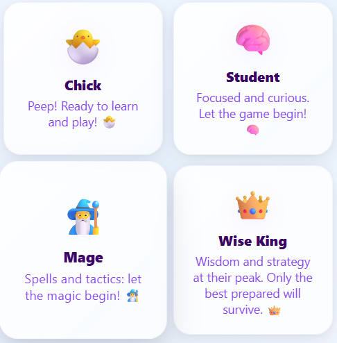
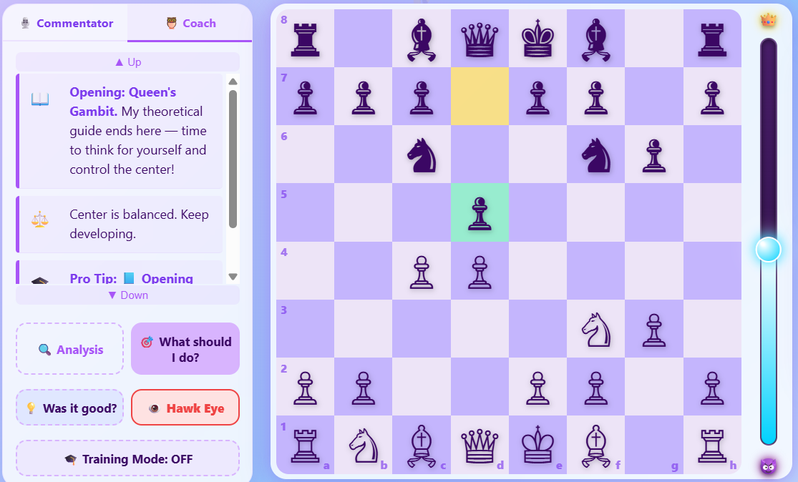
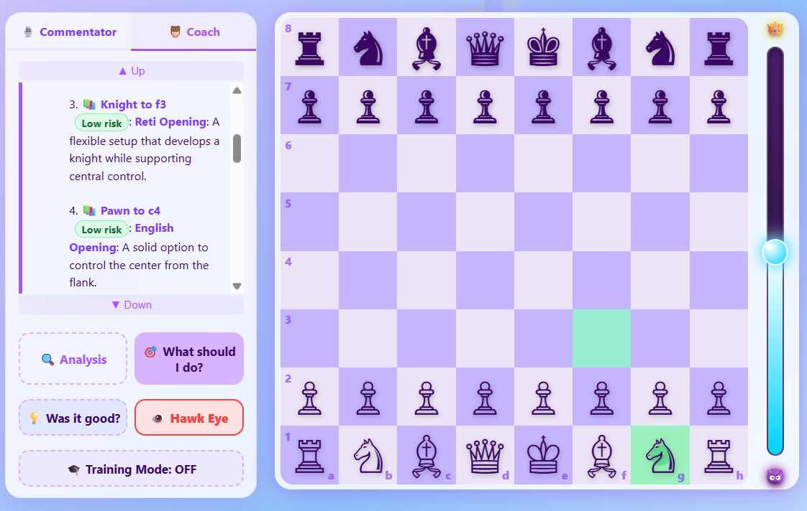
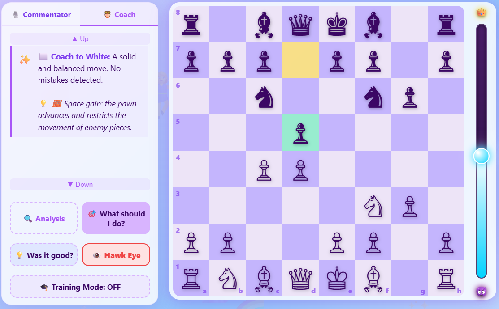
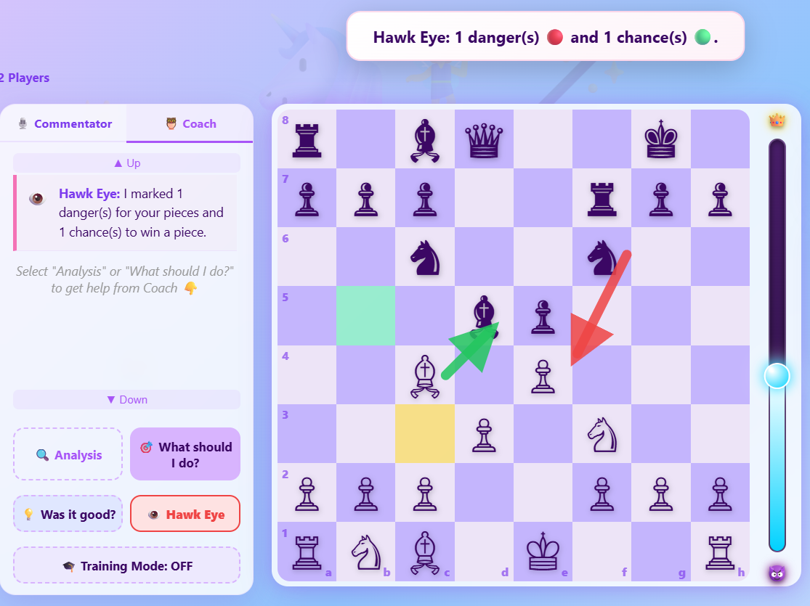
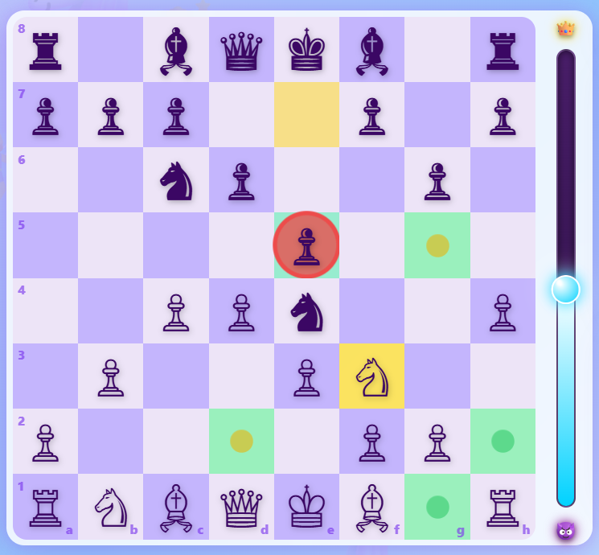
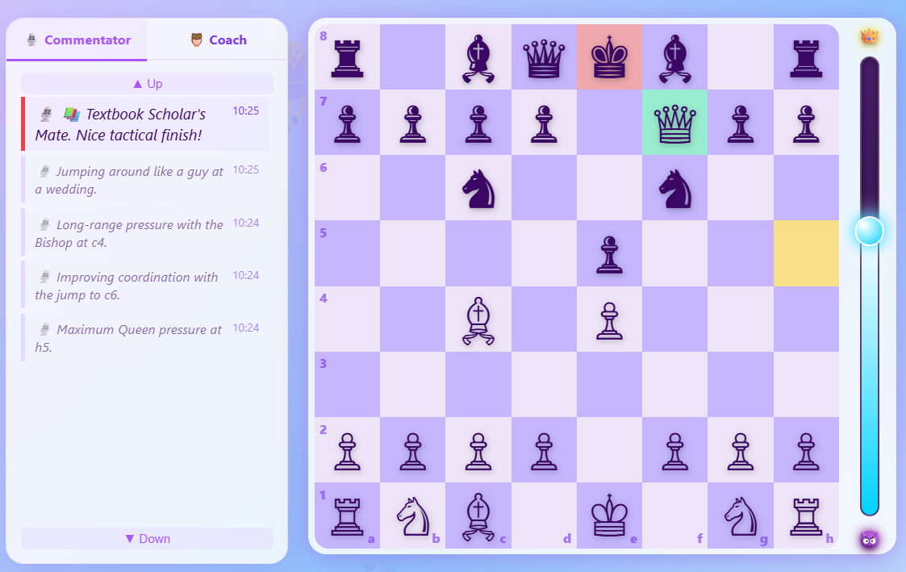
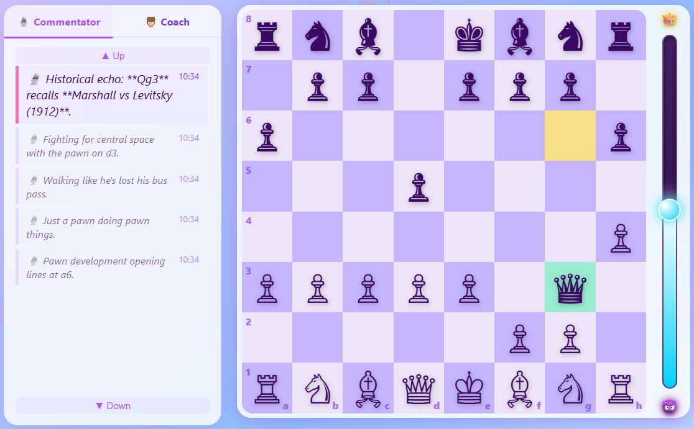
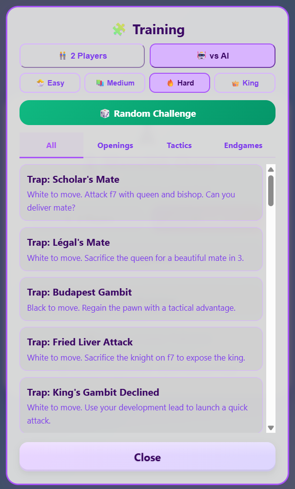

# ♟️ Monolith Chess

> A complete, single-file chess game built for children learning to play.  
> No installation. No internet. No accounts. Open the `.html` file in any browser.

[Leer en Español](README_es.md)

---

## Why this exists

I built Monolith Chess for my 9-year-old daughter.

She wanted to learn chess, but every app I found was either too hard (she lost constantly and gave up), too simple (it felt like a toy), or full of ads and distractions. I wanted something that would teach her the real game — FIDE rules, real tactics — but that would also hold her hand when she made a mistake, explain *why* a move was bad, and celebrate her when she did something clever.

The result is a game that puts pedagogy first. The Coach is more important than the AI. Losing gracefully to a 7-year-old is a feature, not a bug.

## Goals and Non-Goals

### Goals

- **Teach, not defeat.** The primary job is to explain the game, prevent frustration, and build pattern recognition. The AI opponent is secondary.
- **Zero friction.** No installation, no account, no internet required after the first download. Works on a 10-year-old laptop and a modern phone equally.
- **Real chess, not a simplified version.** Full FIDE rules — en passant, castling, threefold repetition, the 50-move rule, all of it.
- **Forgiving at the bottom, challenging at the top.** Easy and Medium let beginners feel what winning feels like. Hard and Wise King exist for when they are ready for a real test.
- **Monolithic mastery.** Everything — engine, coach, opening book, training library, animations, sounds — lives in a single `.html` file of ~604 KB. Zero dependencies.

### Non-Goals

- **Defeating titled players.** This is not Stockfish. The engine peaks around ~1750 ELO.
- **Online multiplayer.** Local play only.
- **Advanced preparation tools.** The opening book is curated for teaching, not professional preparation.
- **Benchmark performance.** Clean, readable JavaScript takes priority over micro-optimised techniques.

---

## How to Play

1. **Download** the `.html` file.
2. **Double-click** it. It opens in any modern browser (Chrome, Firefox, Safari, Edge).
3. **Choose** *vs AI* or *2 Players* from the main menu.
4. **Click a piece** to select it. Legal destination squares appear as dots.
5. **Click a destination** to move.

That is everything. The game handles the rest.

---

## Difficulty Levels

### 🐣 Easy — *Chick* (~630 ELO)

**Target:** Complete beginners, children under 8, first-time players.

2-ply depth · 40% mistake rate · ±12 cp noise · no book · no quiescence

### 📚 Medium — *Student* (~1010 ELO)

**Target:** Players who know the rules and want their first real game.

4-ply depth · 20% mistake rate · ±6 cp noise · book (first 2 moves) · full quiescence

### 🔥 Hard — *Mage* (~1400 ELO)

**Target:** Experienced casual players who want a real test.

6-ply depth · 5% mistake rate · no noise · full book · all search techniques active

### 👑 Master — *Wise King* (~1750 ELO)

**Target:** Strong club players and advanced amateurs.

9-ply depth · 0% mistakes · 10s time budget · full book · full evaluation · Training Mode auto-disabled




### Difficulty Summary

| Level | ELO est. | Depth | Mistake rate | Noise | Book | Quiescence |
|---|---|---|---|---|---|---|
| 🐣 Easy | ~630 | 2 | 40% | ±12 cp | ❌ | ❌ |
| 📚 Medium | ~1010 | 4 | 20% | ±6 cp | first 2 moves | ✅ |
| 🔥 Hard | ~1400 | 6 | 5% | none | ✅ full | ✅ |
| 👑 Wise King | ~1750 | 10 | 0% | none | ✅ full | ✅ |

---

## The Coach

The Coach (El Profesor) is the heart of the game. Interactive chess tutor, context-aware, bilingual at all times.

### 🔍 Analysis
Evaluates center control, X-Ray threats, piece safety, king safety, material balance, game phase, and opening theory status.



### 🎯 What should I do?
Engine-backed move suggestions with risk badges, strategic explanations, opening theory headers, and click-to-highlight on the board. **Kasparov's Law:** when checkmate exists, it is shown alone. **Fair Trade Law:** equal-value captures never trigger hanging warnings.



### 💡 Was it good?
Post-move verdict (Excellent / Good / Acceptable / Inaccuracy / Mistake) with refutation arrow for mistakes.



### 🦅 Hawk Eye
Visual threat scanner. Red arrows = your pieces in danger. Green arrows = free captures available.



### 🎓 Training Mode
Spider Sense (attacked pieces glow), colour-coded move destinations, blunder prevention with confirmation tap. Auto-disabled at Wise King level.



---

## The Commentator

Narrates every move in real time. Recognises opening names, Scholar's Mate formation, Greek Gift sacrifice, knight fork incursions, historical motifs, and major material swings.

Three styles, with labels now visible under the slider:
- **🧐 Serious** — technical, precise
- **⚖️ Mixed** — balanced (default)
- **🎉 Playful** — humorous and dramatic




---

## Training Library

| Tab | Positions | Sample topics |
|---|---|---|
| Openings | 7 | Scholar's Mate, Fried Liver Attack, Budapest Gambit |
| Tactics | 15 | Fork, pin, skewer, discovered attack, back rank, zugzwang |
| Endgames | 14 | Lucena, Philidor, square rule, king opposition, wrong bishop |
| Random | 100 | Mixed positions from real games |



---

## FIDE Rules

| Rule | Status |
|---|---|
| Legal move generation — all pieces | ✅ |
| Check, checkmate, stalemate | ✅ |
| En passant | ✅ |
| Castling — both sides, rights tracking, blocked through check | ✅ |
| Pawn promotion — auto-queen or player choice | ✅ |
| Insufficient material (KK, KBK, KNK, KBKB same colour) | ✅ |
| Threefold repetition with claim modal | ✅ |
| 50-move rule | ✅ |
| Undo restores full state | ✅ |

---

## Settings

| Setting | Options |
|---|---|
| Language | 🇪🇸 Spanish / 🇬🇧 English (auto-detected on first load) |
| Theme | 🪄 Magic · 🌲 Forest · 🌊 Ocean · 🏛️ Classic · ⚽ Football |
| Commentator style | Serious · Mixed · Playful |
| Sound | On / Off |
| Training Mode | On / Off |


---

## What's new in v2.0.0

This release features a major architectural engine update alongside a complete rebuild of the pedagogical layer. The engine is no longer "just a wrapper"—it is now a refined tactical core.

### Opening Theory in the Professor

The two main Professor buttons now speak the language of chess openings.

**Analysis (🔍)** detects whether your current position has known theoretical continuations. If it does, it says *"You are still in theory — press What should I do? to see the next theoretical moves."* If you have left the book it says so clearly too.

**What should I do? (🎯)** shows a header line naming the opening and the number of theoretical continuations available, directly above the move list. After 1.Nf3 Nf6, you see: *"📚 Reti Opening — 3 theoretical continuations available below."* After 1.d4 Nf6 2.c4 e6 3.Nc3 Bb4: *"📚 Nimzo-Indian Defence"*. The detection uses a broad algorithm that catches positions even when the exact sequence is not stored as a book key.

### Missed Opportunity Detection
The Coach no longer just warns you when you hang a piece; it can now detect if you **missed a golden tactical opportunity** (like a free piece or a forced mate) because you were too focused on the opponent's last move. It will tell you exactly what the hidden move was and explain its strategic intent.

### 3rd Person Commentator & Easter Eggs
The announcer now narrates games strictly in the third person, acting like a real sports broadcaster. It explicitly names captured pieces with proper grammar and includes new clean family jokes and musical easter eggs (like singing Queen's *Runaway* when the Queen flees).

### Expanded Opening Book

From 48 positions / 140 entries to **97 positions / 274 entries**. New coverage: French Defence (Winawer, Tarrasch, Advance, Exchange), Scandinavian, Caro-Kann (Classical, Karpov, Advance), English (Symmetrical, Anglo-Indian, Four Knights), Nimzo-Indian (Rubinstein, Classical, Sämisch), Grünfeld, Queen's Indian, Benoni, Reti with all black responses, extended London System.

Positions that previously caused a false *"you have left the book"* at move 2 — such as 1.Nf3 Nf6 or 1.d4 e6 — are now correctly detected as theoretical.

### Training Library

A new **🧩 Training** button appears directly on the main menu — no longer buried in Options. It opens a library of 36 curated learning positions in three tabs:

- **Openings (7)** — Scholar's Mate, Légal's Trap, Budapest Gambit, Fried Liver, King's Gambit, Petrov blunder, Four Knights fork
- **Tactics (15)** — Back rank mate, knight fork, absolute pin, discovered attack, double check, skewer, queen trap, smothered mate, Anastasia's mate, Arabian mate, zugzwang, bishop sacrifice on h6, battery, and more
- **Endgames (14)** — Ladder mate, queen mate, king opposition, pawn promotion, Lucena, Philidor, square rule, wrong bishop, two bishops vs king, and more

A **🎲 Random Challenge** button loads one of 100 additional curated positions at random, spanning Sicilian middlegames, Ruy López structures, Indian defences, and pure endgames.

### Full Support for Playing as Black

Fixed a transition bug that previously prevented the AI from continuing the game if the human player chose to play as Black. The game now handles side-switching seamlessly across all difficulty levels.

### Checkmate Handling Fixed

When a checkmate in 1 exists, the Professor now shows exactly one move with the header *"🏆 Checkmate in 1! This move ends the game."* Previously the pedagogical guarantee was forcing a second irrelevant move to appear even when the game was already won.

### Commentary Style Bug Fixed

The "More serious" setting (level 0) was impossible to select — `parseInt("0") || 1` evaluates to `1` in JavaScript because `0` is falsy. Fixed with an explicit `isNaN` check. Both menus now also show tick labels (*Serious | Mixed | Playful*) directly under the slider.

### Victory Detection Fixed

In AI mode, confetti now fires only when the human wins. Previously it fired for both outcomes.

### Anti-Repetition 2.0 (FIDE Standard)

The Wise King now understands the strategic value of a draw. While previous versions used a blind penalty for repeated positions, v2.0.0 evaluates threefold repetition as exactly **0.0 (Draw)**.

This architectural shift allows the engine to:
- **Force a draw** by repetition when it is materially behind (e.g., losing a piece against a stronger opponent).
- **Avoid a draw** by repetition when it is ahead, seeking alternative winning lines instead.

Combined with a corrected **Zobrist Hashing** implementation that tracks castling rights and en-passant state, the engine no longer falls into infinite "shuffle" loops in complex middle-games.

### Engine — Critical Bug Fixes

Several bugs in the search engine were identified and corrected post-release. These fixes have a significant effect on the Wise King level.

**Aspiration windows for Black** — the window bounds were passed to `minimax` in White's score space. With Black, `(α, β)` must be inverted to `(-β, -α)`. Without this fix the Wise King playing Black was effectively blind from depth 3 onwards, producing moves like Kd7 on move 7 when a free piece was available.

**PVS null window for the minimiser** — the null window used `(α, α+1)` for both sides. The correct window for a minimiser node is `(β-1, β)`.

**LMR re-search condition** — the re-search after a reduced null-window probe used `v > α && v < β`. The `v < β` guard is wrong: any fail-high (`v > α`) must trigger a full re-search regardless of whether it also exceeds β. Without this fix, shallow searches returning large scores were trusted without verification.

**multiPV alpha update** — when `multiPV === 1`, the alpha update for Black used `β = Math.min(β, −scoreForMe)`, mixing score spaces and collapsing the window on good positions.

**Aspiration failsafe** — after 3 widening attempts the engine could return stale scores. A guaranteed full-window re-search now runs as a fourth fallback.

### Engine — Strength Improvements

- **Horizon Effect Fix:** Quiescence search now evaluates checks up to depth 2, preventing the AI from going blind and hanging pieces during long tactical exchanges.
- **Reckless Attack Prevention:** The engine no longer sacrifices material to expose the enemy king if its own minor pieces are not yet developed (`attackerUndeveloped <= 1`).
- Passed pawn bonus scales **×4.5** in endgame (was ×3) and King centralization triggers earlier (`eg > 0.4`).
- TT move ordering: best move stored per TT entry, searched first at priority 1,000,000
- Counter move heuristic: quiet moves that refuted the opponent's last move scored at 48,000
- MVV-LVA pre-sorting of root moves before depth-1 iteration
- Futility pruning extended to depth 3 (margin 500 cp)
- Aspiration delta widened to ±75 cp (was ±50)
- Piece values tuned: N=305, B=333
- King safety loop restructured: each attacking piece counted once (was once per attacked zone square — overcounting)

---

## Internal Architecture

### Single-file design

~604 KB. One `.html` file. No external dependencies, no CDN calls, no cookies, no network requests after load.

### Search

Web Worker + main-thread fallback. Alpha-beta stack: Iterative Deepening, PVS, NMP (R=2/3), LMR, Futility Pruning (depth ≤ 3, margins 150/300/500 cp), Aspiration Windows (±75 cp, guaranteed full-window fallback), Quiescence Search (max depth 8, delta pruning), Check Extensions.

200K-entry Zobrist transposition table in the Worker with depth-aware eviction. Each entry stores the **best move** for ordering in the next iteration.

Move ordering: TT move (priority 1,000,000) → MVV-LVA captures → promotions → killer moves → counter move → history heuristic → king tropism → central bonus. Root moves pre-sorted with MVV-LVA before depth-1.

### Evaluation

PeSTO-style PST tables, tapered king evaluation (middlegame ↔ endgame), pawn structure (doubled −15, isolated −20, passed pawn rank×15 scaled ×4.5 in endgame), bishop pair (+40), rook activity (open file +25, 7th rank +20), dynamic king safety (quadratic penalty per attacking piece, capped at 80 cp).

Piece values: N=305, B=333, R=500, Q=900 (bishop correctly valued above knight by 28 cp).

### Opening Book

97 positions, theory-weighted at Hard/Wise King, uniform random at Medium (2 moves), disabled at Easy.

### Audio

All sounds synthesised at runtime via Web Audio API. Zero audio files bundled.

---

## Mobile Support

Viewport locked · `touch-action: manipulation` · board `min(96vw, 520px)` · webkit fullscreen · Worker fallback.  
Tested on Chrome for Android, Safari for iOS, Firefox for Android.

---

## Compatibility

ES2017+ required. Tested on Chrome 90+, Firefox 88+, Safari 14+.

---

## Changelog

[ChangeLog](docs/CHANGELOG.md)

---

## AI Collaboration samples

[AI Collaboration](docs/AI_COLLABORATION.md)

## How to Contribute

- **Bugs & features:** Please open an **Issue** describing the bug or feature request with steps to reproduce, expected vs actual behaviour, and screenshots when helpful. Issues are the preferred place for discussion and triage.
- **Code changes:** Fork the repo, create a branch named `fix/your-brief-desc` or `feature/your-brief-desc`, and open a **Pull Request**. Small, focused PRs are easier to review.
- **Tests & scripts:** If you change or run the `stockfish_tests` scripts, list any setup steps in the PR and include relevant logs. See `stockfish_tests/README.md` for test setup.
- **Review & communication:** Use Issues to request reviews or design feedback; maintainers will label and triage incoming contributions.


## Stockfish Tests (Training the Engine)

The engine's heuristics and positional weights were **trained and tuned by playing automated tournaments against Stockfish**. A set of scripts and utilities to run automated matches between the in-browser engine (`mChess.html`) and Stockfish was created to collect results and produce quick analysis.

- Location: [stockfish_tests](stockfish_tests)
- Quick commands (from the project root):

```bash
# Run a small tournament (writes results to stockfish_tests/tournament_results.json)
node stockfish_tests/arena_tournament.js

# Inspect the last results
node stockfish_tests/analyze_results.js
```

Notes:
- `arena_tournament.js` opens `mChess.html` from the parent folder and expects `stockfish.exe` in the project root (or set `STOCKFISH_PATH`).
- Results and suggested patches will be saved inside `stockfish_tests`.

### English / Spanish READMEs

The `stockfish_tests` folder contains both `README.md` and `README_es.md` describing how to run the scripts and where the results are written. Open them for detailed instructions.


## License

Apache License 2.0  
Copyright 2026 Aaron Vazquez Fraga

---

## How this was built

Monolith Chess was designed and directed by Aaron Vazquez Fraga. The code was written almost entirely by AI assistants.

The bulk of the implementation — engine architecture, search techniques, the Professor system, opening book, training library, and most bug fixes — was written by **Claude Sonnet** (Anthropic). **Gemini Pro** (Google) contributed to earlier structural decisions and alternative approaches. **ChatGPT** (OpenAI) helped with isolated problems in the earlier phases of development.

The ideas, the pedagogy, the product decisions, the 1000+ test games, and the direction of every iteration came from a human who wanted a better way to teach his daughter chess. The code came from the models.

This is an honest record of how the project was made. It is also, perhaps, a document of what human-AI collaboration looks like when it is working well.

---

*Monolith Chess v2.0.0 — A chess game made for a 9-year-old, that accidentally became a serious engine.* *~604 KB. Zero dependencies. Open the file and play.*
