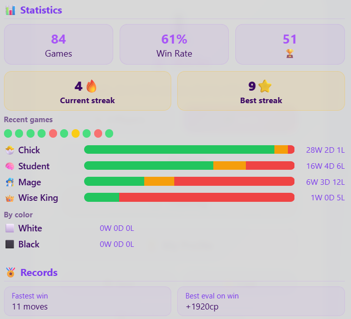
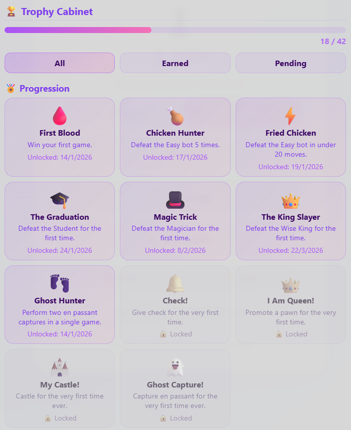
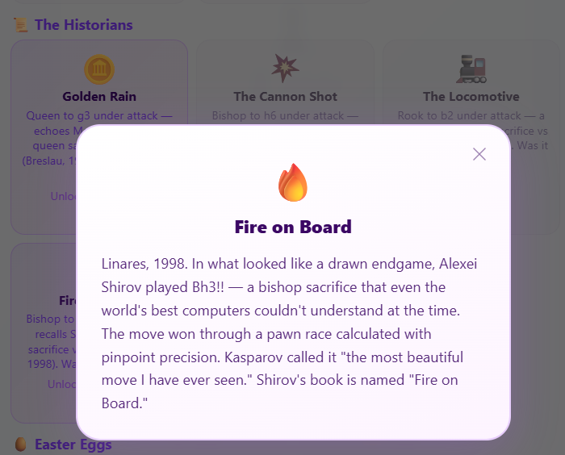

# ♟️ Airin Chess

> A complete, single-file chess game built for children learning to play.  
> No installation. No internet. No accounts. Open the `.html` file in any browser.

[Leer en Español](README_es.md)

---

## Why this exists

I built Airin Chess for my 9-year-old daughter.

She wanted to learn chess, but every app I found was either too hard (she lost constantly and gave up), too simple (it felt like a toy), or full of ads and distractions. I wanted something that would teach her the real game — FIDE rules, real tactics — but that would also hold her hand when she made a mistake, explain *why* a move was bad, and celebrate her when she did something clever.

The result is a game that puts pedagogy first. The Coach is more important than the AI. Losing gracefully to a 7-year-old is a feature, not a bug.

## Goals and Non-Goals

### Goals

- **Teach, not defeat.** The primary job is to explain the game, prevent frustration, and build pattern recognition. The AI opponent is secondary.
- **Zero friction.** No installation, no account, no internet required after the first download. Works on a 10-year-old laptop and a modern phone equally.
- **Real chess, not a simplified version.** Full FIDE rules — en passant, castling, threefold repetition, the 50-move rule, all of it.
- **Forgiving at the bottom, challenging at the top.** Easy and Medium let beginners feel what winning feels like. Hard and Wise King exist for when they are ready for a real test.
- **Monolithic mastery.** Everything — engine, coach, opening book, training library, animations, sounds — lives in a single `.html` file of ~860 KB. Zero dependencies.

### Non-Goals

- **Defeating titled players.** This is not Stockfish. The engine reaches **~1652 ELO** at Wizard level and **~1830 ELO** at Wise King level (validated: 40-game PC tournaments vs UCI_Elo 1750, v2.23.0). Actual strength depends on hardware — see calibration note below.
- **Online multiplayer.** Local play only.
- **Advanced preparation tools.** The opening book is curated for teaching, not professional preparation.
- **Benchmark performance.** Clean, readable JavaScript takes priority over micro-optimised techniques,18 though v2.1.0 introduced critical low-level bottlenecks fixes.

---

## How to Play

**Locally**

1. **Download** the `.html` file.
2. **Double-click** it. It opens in any modern browser (Chrome, Firefox, Safari, Edge).
3. **Choose** *vs AI* or *2 Players* from the main menu.
4. **Click a piece** to select it. Legal destination squares appear as dots.
5. **Click a destination** to move.

**Online**

1. **Go to** GitHub Pages site: [https://vafran.github.io/](https://vafran.github.io/)  
2. **Play directly** in the browser. No download needed.

---

## Difficulty Levels


| Level | ELO est. | Depth | Time cap | Mistake rate | Book |
|---|---|---|---|---|---|
| 🐣 Easy | ~630 | 2 | 0.5s | 40% | ❌ |
| 📚 Medium | ~1010 | 5 | 5s | 15% | first 2 moves |
| 🔥 Wizard | ~1652 (validated) | up to 30 | 15s | 0% | ✅ full |
| 👑 Wise King | ~1830 (validated) | up to 30 | 30s | 0% | ✅ full |

> **ELO calibration hardware:** CoolPC Black VIII — AMD Ryzen 7 3700X @ 4.4 GHz, 16 GB DDR4 3200 MHz (~95k NPS in tournament conditions).
>
> ⚠️ **Hardware note:** Airin is a pure JavaScript engine running in the browser. Its strength scales directly with your device's CPU speed — the time budget (15s / 30s) is fixed, but the search depth reached within that budget is not. On a mid-range gaming PC you can expect the validated ELO figures above. On a typical laptop expect roughly 50–100 ELO less; on a phone or tablet, 150–250 ELO less. Easy and Medium are effectively hardware-independent in practice — their depth caps (2 and 4) are always reached well before the time budget on any modern device. Wizard and Wise King search as deep as time allows, so their strength scales with your hardware.

---

## The Coach

The Coach (El Profesor) is the heart of the game. Interactive chess tutor, context-aware, bilingual at all times.

### 🔍 Analysis
Evaluates center control, X-Ray threats, piece safety, king safety, material balance, game phase, and opening theory status.


### 🎯 What should I do?
Engine-backed move suggestions with risk badges, strategic explanations, opening theory headers, and click-to-highlight on the board. **Kasparov's Law:** when checkmate exists, it is shown alone. **Fair Trade Law:** equal-value captures never trigger hanging warnings.


### 💡 Was it good?
Post-move verdict (Excellent / Good / Acceptable / Inaccuracy / Mistake) with refutation arrow for mistakes.


### 🦅 Hawk Eye
Visual threat scanner. Red arrows = your pieces in danger. Green arrows = free captures available.


### 🎓 Training Mode
Spider Sense (attacked pieces glow), colour-coded move destinations, blunder prevention with confirmation tap. Auto-disabled at Wise King level.


---

## Player Profile & Trophy Cabinet

Airin remembers you. Every game you play is tracked, and your progress is rewarded.

### 📊 Your Profile

Upon starting for the first time, Airin asks for your name. From that point on, it tracks your full history.

- **Lifetime stats** — total games, wins, draws, losses, undos used, hints requested
- **Stats by color** — separate win/draw/loss record for games played as White and as Black
- **Hall of Records** — fastest win (fewest moves) and highest evaluation advantage ever achieved
- **Per-bot W/D/L bars** — colour-coded record against each difficulty level
- **Editable name** — tap your name in the profile to rename yourself at any time



### 🏆 The Trophy Cabinet

**64 trophies across 8 categories** — one for every square, one category for every row.

**🏅 Progression** — defeat each difficulty level, pull off your first en passant, make your first check, castle for the first time.

**🧠 Technical** — castle and never move your king again, deliver checkmate with your King marching to rank 6, climb the No-Undo Ladder from Easy all the way to the Wise King.

**⚡ Relentless** — win in 15 moves, beat Hard without any hints, force a draw against the Magician, build a win streak, win 50 games on each side of the board.

**📚 Learning (7):** Use the Coach 10 times, explore 5 named openings, complete your first puzzle 🎓, complete 10 puzzles total 🔁, use "What should I do?" 3 times in one game 📖, review your play with "Was it good?" 5 times (*The Analyst*), and complete 3 openings + 4 mate-1s + 6 mate-2s + 8 mate-3s + 10 mate-4s (*FEN Master* 🧘).

**⚔️ Tactics** — rook on the 7th rank, double rooks, battery, pawn fork, discovered check, pawn storm, and more.

**🥊 Two-Player** — 7 trophies exclusive to local 2-player mode.

**📜 The Historians** — recreate legendary sacrifices from chess history in real time.

**🥚 Easter Eggs (hidden)** — 6 secret trophies. Names hidden until unlocked. You'll figure them out.

Complete every trophy in a category to earn its **medal**. Collect all 64 trophies and all 8 medals to discover what lies beyond the 64th square.




### 🏛️ The Historians

Four historical moments are hidden in the game. Each requires a specific sacrifice under specific material conditions:

| Trophy | Echoes | Moment |
|--------|--------|--------|
| 🌧️ Golden Rain | Marshall vs Levitsky, 1912 | Queen to g3, attacked, rich middlegame |
| 💥 The Cannon | Vladimirov vs Epishin, 1987 | Bishop to h6, attacked, middlegame |
| 🚂 The Locomotive | Sanz vs Ortueta, 1933 | Rook to b2, attacked, endgame |
| 🔥 Fire on the Board | Shirov vs Topalov, 1998 | Bishop to h3, attacked, deep endgame |

Unlock all four to earn the **📜 Grand Historian** medal.

The Training Library's **Legends** tab lets you load the exact positions from these games to study and practice the sacrifices.



### 🎉 Real-Time Celebrations

When you unlock a trophy mid-game, a celebration popup appears immediately — you don't need to check the cabinet. The game acknowledges the moment as it happens.

### 💾 Save & Load

Your profile lives in your browser. To carry it across devices:

- **Export** — downloads `<profile_name>_<current_date>.airin` to your device downloads folder.
- **Import** — upload a previously exported file to restore your profile on any device


---


## The Commentator

Narrates every move in real time. Recognises opening names, Scholar's Mate formation, Greek Gift sacrifice, knight fork incursions, historical motifs, and major material swings.

Three styles, with labels now visible under the slider:
- **🧐 Serious** — technical, precise
- **⚖️ Mixed** — balanced (default)
- **🎉 Playful** — humorous and dramatic


---

## Training Library

| Tab | Positions | Content |
|---|---|---|
| Openings | 4 | Scripted traps: Scholar's Mate, Légal's Mate, Fool's Mate, Ponziani Gambit |
| Mate in 1 | 6 | Verified single-move checkmates |
| Mate in 2 | 12 | Verified 3-ply forced mates |
| Mate in 3 | 16 | Verified 5-ply forced mates |
| Mate in 4 | 22 | Verified 7-ply forced mates (historical masterpieces) |
| Legends | 4 | The 4 historical positions (Marshall, Vladimirov, Sanz-Ortueta, Shirov-Topalov) |


---

## FIDE Rules

| Rule | Status |
|---|---|
| Legal move generation — all pieces | ✅ |
| Check, checkmate, stalemate | ✅ |
| En passant | ✅ |
| Castling — both sides, rights tracking, blocked through check | ✅ |
| Pawn promotion — auto-queen or player choice | ✅ |
| Insufficient material (KK, KBK, KNK, KBKB same colour) | ✅ |
| Threefold repetition with claim modal | ✅ |
| 50-move rule | ✅ |
| Undo restores full state | ✅ |

---

## Settings

| Setting | Options |
|---|---|
| Language | 🇪🇸 Spanish / 🇬🇧 English (auto-detected on first load) |
| Theme | 🪄 Magic · 🌲 Forest · 🌊 Ocean · 🏛️ Classic · ⚽ Football |
| Commentator style | Serious · Mixed · Playful |
| Sound | On / Off |
| Sound theme | 🎵 Classic (wooden thud) · 🕹️ Retro (beeps) · 🎶 Soft (tones) |
| Training Mode | On / Off |


## Known Issues

| # | Severity | Description | Planned fix |
|---|---|---|---|
| 1 | Low | **Stalemate in won positions (Wise King only)** — In rare simplified endgames (queen + pawns vs lone king), the engine may play a move that stalemates the opponent instead of mating them, converting a win into a draw. Root cause: the quiescence search evaluates the final position using `evaluate()`

## What's new in v2.25.1 — *Puzzle Library Expansion & FEN Tools*

### ♟ FEN Export
* **Copy FEN button** added next to the PGN copy button in the move history bar. Copies the full FEN of the current position to clipboard — useful for sharing positions, loading them into analysis tools, or importing them back into Airin's Training Library.

### 🎓 Training Library — 64 Puzzles
* 17 new puzzles added (2 mate-in-2, 3 mate-in-3, 12 mate-in-4) — total now **64 positions**.
* Distribution: 6 / 12 / 16 / 22 / 4 openings / 4 legends — harder categories have more puzzles.
* FEN Master trophy requirements raised: **3 openings, 4 mate-1s, 6 mate-2s, 8 mate-3s, 10 mate-4s**.

### 🏫 Coach Fixes
* Anti-blunder filter disabled during mate puzzle analysis — sacrificial moves (Nf6+, Bh6, etc.) are no longer blocked.
* Underpromotion mates (`cxb8=N#`) now correctly detected by the mate-in-1 scanner.

---

## What's new in v2.25.0 — *Training Library Overhaul*

### 🎓 Training Library Restructured
* **Mate in 1 / 2 / 3 / 4 tabs** replace the old Tactics and Endgames sections. Every position is a verified Lichess puzzle.
* **Scripted opening traps** — Scholar's Mate, Fool's Mate, and Ponziani Gambit now play out move-by-move: the engine automatically plays the opponent's blunder moves from the solution array so the player experiences the whole trap.
* **Hint system** — puzzles now show a 🎓 hint banner in the Coach panel instead of a generic engine analysis.
* **Random challenge** now draws from the full verified library (~47 positions) — the old unverified hand-crafted positions are retired.

### 🧘 Trophy: FEN Master
* Replaces *The Dragon*. Unlocks by completing 2 challenges from each of the 5 non-historical categories (Openings, Mate in 1, 2, 3, 4).
* Retired trophies are stripped at profile load — existing saves are cleaned up automatically.

### 🔊 Sound Themes
Three synthesised sound themes selectable in Options (main menu and in-game):
* **Classic** — wooden thud: filtered noise burst + sine body, mimicking a real piece on a wooden board. Castling plays two quick thuds.
* **Retro** — square-wave beeps.
* **Soft** — sine tones.

### 🏛️ Legends — Historical Resignations
After finding the key sacrifice in any Legends puzzle, a **resignation modal** appears with the historical context — the forced line, key variations, and period quotes. Pressing **Keep Playing** resumes the scripted AI continuation on the board.

*(For The Statistician feature set from v2.24.0, see the full Changelog).*

---

## Full version history

See [docs/CHANGELOG.md](docs/CHANGELOG.md) for the complete version history.

---


## Internal Architecture

### Single-file design

~860 KB. One `.html` file. No external dependencies, no CDN calls, no cookies, no network requests after load.

### Search

Web Worker + main-thread fallback. Alpha-beta stack: Iterative Deepening, PVS, NMP (adaptive R), LMR (logarithmic formula), Futility Pruning (depth ≤ 2, margins 175/350 cp), Aspiration Windows (±75 cp), Quiescence Search (max depth 5 non-check / 8 in-check, SEE pruning, delta pruning), Check Extensions, Advanced Pawn Extensions.

1 048 576-entry Zobrist transposition table (20 MB, `Int32Array`) in the Worker with depth-aware eviction. EXACT entries are never overwritten by UPPER/LOWER entries. Each entry stores the **best move** for ordering in the next iteration. Board represented as flat `Int8Array(64)` — 45–80k NPS on typical hardware.

Move ordering: TT move (priority 1,000,000) → MVV-LVA captures → promotions → killer moves → counter move → history heuristic → king tropism → central bonus. Root moves pre-sorted with MVV-LVA before depth-1.

### Evaluation

PeSTO-style dual-phase PST tables (`PST_MG` / `PST_EG`) with integer tapered interpolation (`(mgVal × ph + egVal × (24-ph)) / 24 | 0`). Pawn structure: doubled −15, isolated −40, passed pawn scaled with phase + Rule of the Square. Bishop pair +40. King Shield/Storm (middlegame). Rook activity (open file +40, 7th rank +35, connected rooks +15). Dynamic king safety. Knight outpost detection. Bad bishop penalty.

Piece values: N=325, B=335, R=500, Q=900 (bishop correctly valued above knight by 10 cp). Tapered middlegame/endgame interpolation (mgPV/egPV).

### Opening Book

~826 entries across ~100 positions, theory-weighted at Hard/Wise King, uniform random at Medium (2 moves), disabled at Easy.

### Audio

All sounds synthesised at runtime via Web Audio API. Zero audio files bundled. Three selectable themes: Classic (filtered noise + sine body), Retro (square wave), Soft (sine).

---

## Mobile Support

Viewport locked · `touch-action: manipulation` · board `min(96vw, 520px)` · webkit fullscreen · Worker fallback.  
Tested on Chrome for Android, Safari for iOS, Firefox for Android.

---

## Compatibility

ES2017+ required. Tested on Chrome 90+, Firefox 88+, Safari 14+.

---

## Changelog

[ChangeLog](docs/CHANGELOG.md)

---

## AI Collaboration samples

[AI Collaboration](docs/AI_COLLABORATION.md)

## How to Contribute

Airin is a single `.html` file with no build step, no bundler, no package manager. Open it in any browser and it runs — which means many contributions take minutes to try.

### Easy contributions — no tournament needed

| Area | What |
|---|---|
| Bug reports | Open an Issue with steps to reproduce + screenshot |
| Commentary phrases | Add entries to the `I18N` object in both `es:` and `en:` blocks |
| Opening book | Add lines to `OPENING_BOOK` (comma-separated SAN → `[{m, w}]`). Only unambiguous theoretical moves — a wrong book move fires every game |
| Training positions | Add FENs to the Training Library with theme and description |
| UI / CSS | Edit inline styles or CSS variables; test by opening the file directly |

### Engine changes — tournament required

The search engine is a ~1,200-line alpha-beta inside a Web Worker. Any change to evaluation, search parameters, or move ordering requires tournament validation before it can merge:

- **Development validation (each patch):** 20-game tournament (~4 hours at 15s/move, ~7–8 hours at 30s/move)
- **Release sign-off (merging to main):** 40-game tournament with UCI_Elo (~7.5 hours at 15s/move, ~14–16 hours at 30s/move)

```bash
cd stockfish_tests
# Development — validate each patch (~4h at 15s)
node arena_tournament.js --batch --sf-mode uci_elo --sf-value 1750 --games 20
# Release — required before opening a PR to main (~7.5h at 15s)
node arena_tournament.js --batch --sf-mode uci_elo --sf-value 1750 --games 40
```

Requires Node.js, Puppeteer, and `stockfish.exe` in the project root.

**The rule:** one change per PR. Never combine two engine changes — if ELO drops, you cannot isolate the cause. Run tournaments on a desktop PC (laptops thermal-throttle and produce unreliable ELO estimates). Include the tournament JSON in the PR description.

### Architecture notes

- The entire game lives in `mChess.html` (~860 KB, ~16,500 lines). No other source files.
- **Two engines:** the Web Worker (plays all game moves) and the main-thread engine (Coach/analysis only, never plays). Changes to one do not affect the other.
- **Worker code** is a JS string inside `createEngineWorker()` — edit it like normal JS, the browser re-parses it on each load.
- **Version bump required** for every engine change — 4 places in the HTML: `<!--` comment, `<title>`, button text, `console.log`.
- **Testing:** open via `file:///` directly. No server needed.


## Stockfish Tests (Training the Engine)

The engine's heuristics and positional weights were **trained and tuned by playing automated tournaments against Stockfish**. A set of scripts and utilities to run automated matches between the in-browser engine (`mChess.html`) and Stockfish was created to collect results and produce quick analysis.

- Location: [stockfish_tests](stockfish_tests)
- Quick commands (from the project root):

```bash
# Official calibrated ELO (recommended)
node stockfish_tests/arena_tournament.js --batch --sf-mode uci_elo --sf-value 1750 --games 20

# Historical depth mode (kept for comparisons)
node stockfish_tests/arena_tournament.js --batch --depth 7 --games 20

# Inspect the last results
node stockfish_tests/analyze_results.js
```

Notes:
- `arena_tournament.js` opens `mChess.html` from the parent folder and expects `stockfish.exe` in the project root (or set `STOCKFISH_PATH`).
- Results and suggested patches will be saved inside `stockfish_tests`.

### English / Spanish READMEs

The `stockfish_tests` folder contains both `README.md` and `README_es.md` describing how to run the scripts and where the results are written. Open them for detailed instructions.


## License

Apache License 2.0  
Copyright 2026 Aaron Vazquez Fraga

---

## How this was built

Airin Chess was designed and directed by Aaron Vazquez Fraga. The code was written almost entirely by AI assistants.

The bulk of the implementation — engine architecture, search techniques, the Professor system, opening book, training library, and most bug fixes — was written by **Claude Sonnet** (Anthropic). **Gemini Pro** (Google) contributed to earlier structural decisions and alternative approaches. **ChatGPT** (OpenAI) helped with isolated problems in the earlier phases of development.

The ideas, the pedagogy, the product decisions, the 1000+ test games, and the direction of every iteration came from a human who wanted a better way to teach his daughter chess. The code came from the models.

This is an honest record of how the project was made. It is also, perhaps, a document of what human-AI collaboration looks like when it is working well.

---

*Airin Chess v2.25.0 — A chess game made for a 9-year-old, that accidentally became a serious engine.* *~1.08 MB. Zero dependencies. Open the file and play.*
