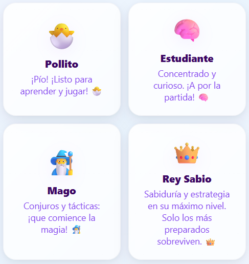
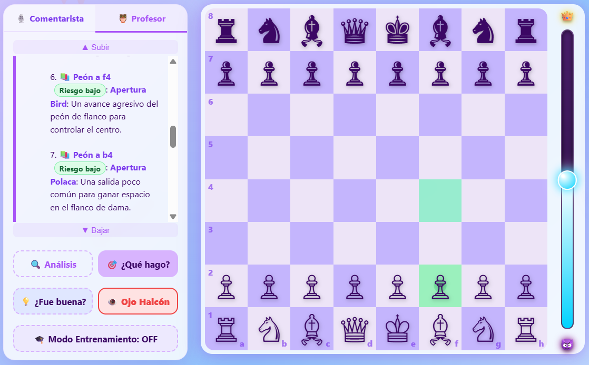
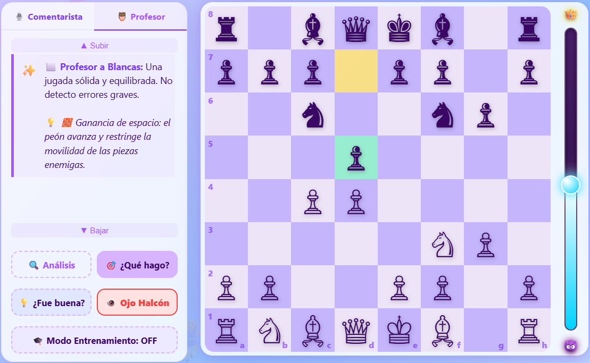
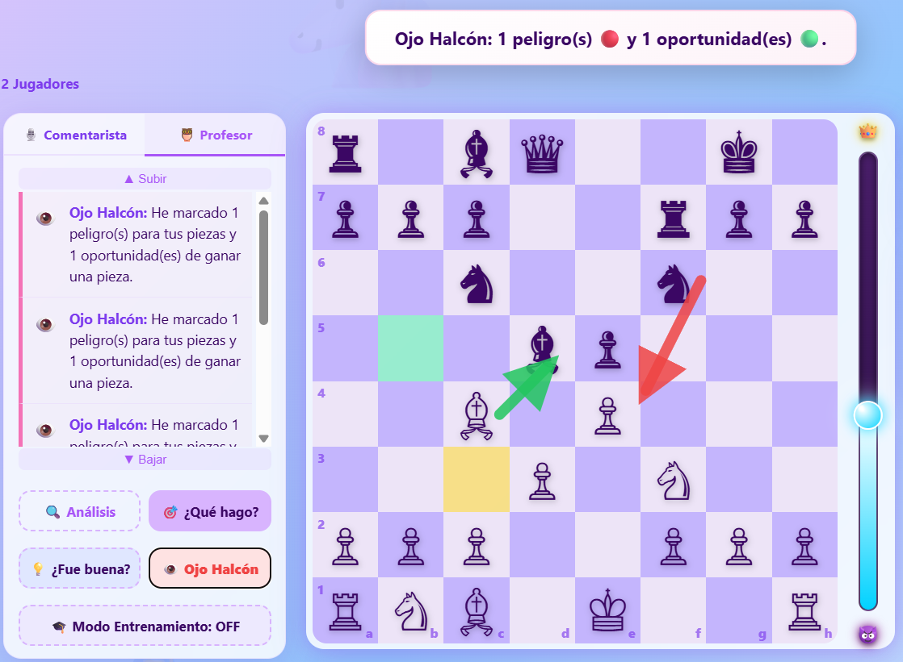
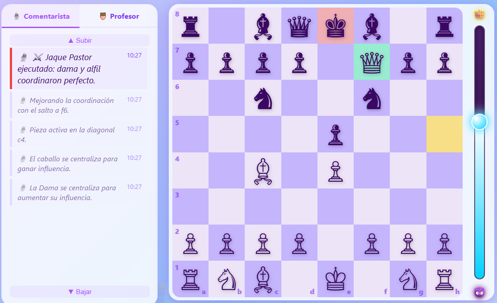
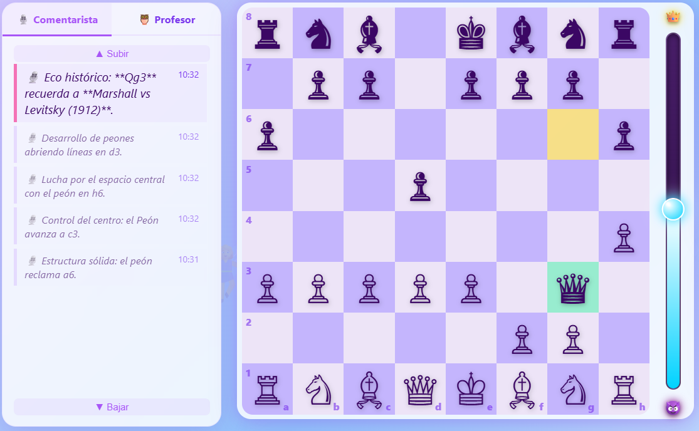
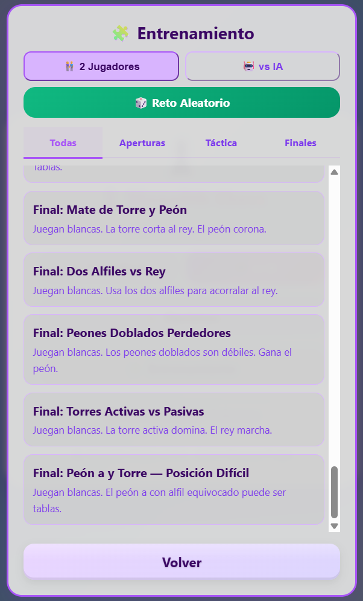

# ♟️ Monolith Chess

> Un juego de ajedrez completo en un solo archivo HTML, construido para niños que aprenden a jugar.  
> Sin instalación. Sin internet. Sin cuentas. Abre el archivo `.html` en cualquier navegador.

[English README](README.md)

---

## Por qué existe este proyecto

Lo construí para mi hija de 9 años.

Quería aprender ajedrez, pero todas las aplicaciones que encontraba eran o demasiado difíciles (perdía constantemente y se rendía), demasiado simples (parecían un juguete), o estaban llenas de anuncios y distracciones. Quería algo que le enseñara el juego real — reglas FIDE, tácticas reales — pero que también le tendiera la mano cuando cometiera un error, le explicara *por qué* una jugada era mala y la celebrara cuando hiciera algo brillante.

El resultado es un juego que pone la pedagogía primero. El Profesor es más importante que la IA. Perder elegantemente ante una niña de 9 años es una característica del diseño, no un defecto.

---

## Objetivos y no-objetivos

### Objetivos

- **Enseñar, no derrotar.** El trabajo principal es explicar el juego, prevenir la frustración y construir el reconocimiento de patrones. El adversario IA es secundario.
- **Cero fricción.** Sin instalación, sin cuenta, sin internet tras la primera descarga. Funciona en un portátil de diez años igual que en un teléfono moderno.
- **Ajedrez real, no una versión simplificada.** Reglas FIDE completas: al paso, enroque, triple repetición, regla de los 50 movimientos, todo.
- **Indulgente abajo, desafiante arriba.** Fácil y Medio existen para que los principiantes sepan lo que es ganar. Difícil y Rey Sabio existen para cuando estén listos.
- **Maestría monolítica.** Todo — motor, entrenador, libro de aperturas, librería de entrenamiento, animaciones, sonidos — vive en un único archivo `.html` de ~676 KB. Cero dependencias.

### No-objetivos

- **Derrotar a jugadores titulados.** Esto no es Stockfish. El motor alcanza picos de **~1818 ELO** (benchmark vs Stockfish profundidad 10).
- **Multijugador en línea.** Solo juego local.
- **Herramientas avanzadas de preparación.** El libro de aperturas está curado para enseñar, no para preparación profesional.
- **Rendimiento de referencia.** Un JavaScript limpio y legible tiene prioridad, aunque la v2.1.0 introdujo correcciones críticas en cuellos de botella de bajo nivel.

---

## Cómo jugar

1. **Descarga** el archivo `.html`.
2. **Haz doble clic** sobre él. Se abre en cualquier navegador moderno (Chrome, Firefox, Safari, Edge).
3. **Elige** *vs IA* o *2 Jugadores* desde el menú principal.
4. **Haz clic en una pieza** para seleccionarla. Las casillas legales aparecen como puntos.
5. **Haz clic en un destino** para mover.

Eso es todo. El juego se encarga del resto.

---

## Niveles de dificultad

### 🐣 Fácil — *Pollito* (~630 ELO)

**Para:** Principiantes, niños pequeños, jugadores que aprenden las reglas.

Profundidad 2 · 40% de errores · ±12 cp de ruido · sin libro · sin quietud

### 📚 Medio — *Estudiante* (~1010 ELO)

**Para:** Jugadores que conocen las reglas y quieren su primera partida real.

Profundidad 4 · 20% de errores · ±6 cp de ruido · libro (primeros 2 movimientos) · quietud completa

### 🔥 Difícil — *Mago* (~1400 ELO)

**Para:** Jugadores casuales con experiencia que quieren una prueba real.

Profundidad 6 · 5% de errores · sin ruido · libro completo · todas las técnicas activas

### 👑 Maestro — *Rey Sabio* (~1818 ELO)

**Para:** Jugadores de club fuertes y amateurs avanzados.

Hasta 30 semijugadas de profundidad (tope de 30s) · 0% de errores · libro completo · evaluación completa · Modo Entrenamiento desactivado automáticamente




### Tabla resumen

| Nivel | ELO est. | Prof. | Error | Ruido | Libro | Quietud |
|---|---|---|---|---|---|---|
| 🐣 Fácil | ~630 | 2 | 40% | ±12 cp | ❌ | ❌ |
| 📚 Medio | ~1010 | 4 | 20% | ±6 cp | primeros 2 mov. | ✅ |
| 🔥 Difícil | ~1400 | 6 | 0% | ninguno | ✅ completo | ✅ |
| 👑 Rey Sabio | ~1818 | hasta 30 (30s) | 0% | ninguno | ✅ completo | ✅ |

---

## El Profesor

El corazón del juego. Tutor de ajedrez interactivo, contextual y bilingüe en todo momento.

### 🔍 Análisis
Evalúa control del centro, amenazas de rayos X, seguridad de piezas, seguridad del rey, balance material, fase de la partida y estado de la teoría de apertura.


### 🎯 ¿Qué hago?
Sugerencias de jugadas respaldadas por el motor, con indicadores de riesgo, explicaciones estratégicas, cabeceras de teoría de apertura y clic para resaltar en el tablero. **Ley de Kasparov:** cuando existe jaque mate, se muestra solo. **Ley del Comercio Justo:** las capturas de igual valor nunca activan avisos de pieza colgada.



### 💡 ¿Fue buena?
Veredicto post-jugada (Excelente / Buena / Aceptable / Inexactitud / Error) con flecha de refutación para los errores.



### 🦅 Ojo Halcón
Escáner visual de amenazas. Flechas rojas = tus piezas en peligro. Flechas verdes = capturas gratuitas disponibles.



### 🎓 Modo Entrenamiento
Sentido Araña (piezas atacadas brillan), casillas de destino con código de colores, prevención de colgadas con confirmación. Se desactiva automáticamente en el nivel Rey Sabio.


---

## El Comentarista

Narra cada movimiento en tiempo real. Reconoce nombres de aperturas, formación del Mate del Pastor, Regalo Griego, incursiones de caballo, motivos históricos y cambios importantes de material.

Tres estilos, con etiquetas ahora visibles bajo el deslizador:
- **🧐 Serio** — técnico y preciso
- **⚖️ Mixto** — equilibrado (por defecto)
- **🎉 Divertido** — humorístico y dramático





---

## Librería de Entrenamiento

| Pestaña | Posiciones | Ejemplos |
|---|---|---|
| Aperturas | 7 | Mate del Pastor, Fried Liver, Gambito Budapest |
| Táctica | 15 | Tenedor, clavada, enfilada, descubierta, pasillo, zugzwang |
| Finales | 14 | Lucena, Philidor, regla del cuadrado, oposición, alfil equivocado |
| Aleatorio | 30 | Puzzles tácticos curados con tema: mate, tenedor, clavada, ensarte, sacrificio, coronación |




---

## Reglas FIDE

| Regla | Estado |
|---|---|
| Generación de jugadas legales — todas las piezas | ✅ |
| Jaque, jaque mate, ahogado | ✅ |
| Captura al paso | ✅ |
| Enroque — ambos lados, derechos, bloqueado en jaque | ✅ |
| Coronación — auto-dama o elección del jugador | ✅ |
| Material insuficiente (KK, KBK, KNK, KBKB mismo color) | ✅ |
| Triple repetición con modal de reclamación | ✅ |
| Regla de los 50 movimientos | ✅ |
| Deshacer restaura el estado completo | ✅ |

---

## Opciones

| Opción | Valores |
|---|---|
| Idioma | 🇪🇸 Español / 🇬🇧 English (autodetectado en el primer acceso) |
| Tema visual | 🪄 Magia · 🌲 Bosque · 🌊 Océano · 🏛️ Clásico · ⚽ Fútbol |
| Estilo del comentarista | Serio · Mixto · Divertido |
| Sonido | Activado / Desactivado |
| Modo Entrenamiento | Activado / Desactivado |

---

## Novedades en v2.12.0

- **Expansión Masiva del Libro de Aperturas**: ~60+ entradas nuevas para QGD, Eslava, Italiana, Francesa y Caro-Kann.
- **Optimización NPS de Seguridad del Rey**: Ray-casting inverso que multiplica el NPS en apertura de ~500 a ~10.000+.
- **Mejoras en Jaque Pastor**: El comentarista ahora detecta amenazas de f7 con mayor precisión y reconoce defensas con f6/Nc6.
- **Estabilidad del Motor**: Corregidos bugs críticos de TDZ y repeticiones Zobrist.

---

## Novedades en v2.11.0

Esta versión, la **Edición de Bugfixes y Evaluación**, añade +130 ELO sobre v2.10 (benchmark: ~1818 vs Stockfish profundidad 10, 10 partidas), corrige 5 bugs de correctitud y desbloquea búsqueda más profunda en finales.

### Motor
- **Captura al paso en quiescence** — El EP ahora es visible para el filtro de quietud, MVV-LVA y poda delta.
- **Regla de los 50 movimientos en minimax** — el motor devuelve 0 (tablas) cuando `halfMoveClock ≥ 100`.
- **Profundidad Rey Sabio 12 → 30** — el tiempo (30s) es el límite real. En finales, d:12 era el cuello de botella; ahora la ID llega tan lejos como el reloj permita.
- **Límite Q-search** — quietud sin jaque tope en 5 (antes 8). NPS medio +56% (18K → 28K).

### Evaluación
- Peligro de peón pasado enemigo: penalización exponencial por rango (rango 7 = 270 cp extra — el motor bloquea).
- Bonus de centralización del rey en el final (`eg > 0.4`).
- Deflación de bonus posicionales: outpost, seguridad del rey, columnas abiertas, penalización dama temprana, todos reducidos para evitar sacrificios de material.

### UI / Reglas
- Orden de detección de tablas corregido: K vs K ya no se declara como ahogado.
- Comentarista del Jaque Pastor cubre variantes con Qf3 y Bc5.
- El Profesor valora correctamente las capturas al paso.

---

## Novedades en v2.1.0

Esta versión, la **Edición de Rendimiento y Heurística**, aporta un salto masivo en fuerza táctica y velocidad de ejecución (+80% NPS) a través de optimizaciones de bajo nivel y heurísticas posicionales clásicas.

### Búsqueda de Alto Rendimiento (40k+ NPS)
Hemos eliminado los tres mayores cuellos de botella del motor:
- **Caché de Posición del Rey (O(1))**: Ya no se escanea el tablero para encontrar a los reyes; sus posiciones se cachean y actualizan en tiempo real.
- **Ray-Casting Inverso**: La detección `isAtk` (pieza atacada) ahora utiliza ráfagas de rayos hacia afuera en lugar de bucles sobre el tablero, reduciendo drásticamente el tiempo de computación.
- **Lazy Selection Sort**: Reemplazado el `.sort()` genérico por una ordenación por selección manual con puntuaciones precalculadas en `Int32Array`, permitiendo cortes Alpha-Beta mucho más rápidos.

### Heurística Avanzada (HCE)
- **Evaluación Tapered**: Los valores de las piezas se interpolan suavemente entre el Medio Juego y el Final (ej: ajuste de paridad Alfil/Caballo según la fase).
- **Movilidad Segura**: Las bonificaciones de movilidad para piezas menores ahora se calculan solo para casillas no controladas por peones enemigos.
- **Lógica de Peones Pasados**: Escaneo de ruta (penalización por casillas de promoción disputadas) y la **Regla del Cuadrado** (detección geométrica de peones imparables en finales).
- **Tabla Hash de Peones**: Caché basada en Zobrist para estructuras de peones para evitar escaneos redundantes.

---

## Novedades en v2.0.0

Esta versión incluye una gran actualización arquitectónica del motor junto con una reconstrucción completa de la capa pedagógica. El motor ya no es solo un soporte; ahora es un núcleo táctico refinado.

### Teoría de aperturas en el Profesor

Los dos botones principales del Profesor ahora hablan el lenguaje de las aperturas de ajedrez.

**Análisis (🔍)** detecta si la posición actual tiene continuaciones teóricas conocidas. Si las tiene, dice *"Sigues dentro de la teoría — pulsa ¿Qué hago? para ver las jugadas teóricas."* Si has salido del libro, también lo dice con claridad.

**¿Qué hago? (🎯)** muestra una línea de cabecera con el nombre de la apertura y el número de continuaciones teóricas disponibles, justo encima de la lista de jugadas. Tras 1.Nf3 Nf6 ves: *"📚 Apertura Reti — 3 continuaciones teóricas disponibles abajo."* Tras 1.d4 Nf6 2.c4 e6 3.Nc3 Ab4: *"📚 Defensa Nimzoindia"*. La detección utiliza un algoritmo amplio que reconoce posiciones aunque la secuencia exacta no esté almacenada como clave del libro.

### Detección de Oportunidades Perdidas
El Profesor ahora no solo te regaña cuando te dejas una pieza, sino que es capaz de detectar si **dejaste escapar una táctica de oro** (como un jaque mate o ganar material limpio) por centrarte demasiado en responder a la última jugada del rival. Te mostrará exactamente cuál era la jugada oculta y su intención estratégica.

### Comentarista en 3ª Persona y Huevos de Pascua
El locutor ahora narra las partidas en estricta tercera persona, separando su rol del trato directo del Profesor. Además, nombra explícitamente la pieza capturada respetando su género gramatical (*"capturando la Torre"*, *"capturando el Caballo"*) e incluye nuevos chistes limpios y huevos de pascua musicales (como cantar *Runaway* de Queen cuando la Dama huye).

### Libro de aperturas ampliado

De 48 posiciones / 140 entradas a **~100 posiciones / ~280 entradas**. Nueva cobertura: Defensa Francesa (Winawer, Tarrasch, Avance, Cambio), Escandinava, Caro-Kann (Clásica, Karpov, Avance), Apertura Inglesa (Simétrica, Anglo-India, Cuatro Caballos), Nimzoindia (Rubinstein, Clásica, Sämisch), Grünfeld, India de Dama, Benoni, Reti con todas las respuestas negras, Sistema Londres ampliado y Siciliana Abierta.

Posiciones que antes generaban un falso *"ya saliste del libro"* en la jugada 2 — como 1.Cf3 Cf6 o 1.d4 e6 — ahora se detectan correctamente como líneas teóricas.

### Librería de Entrenamiento

Un nuevo botón **🧩 Entrenamiento** aparece directamente en el menú principal — ya no está enterrado en Opciones. Abre una biblioteca de 36 posiciones de aprendizaje organizadas en tres pestañas:

- **Aperturas (7)** — Mate del Pastor, Trampa de Legal, Gambito Budapest, Fried Liver, Gambito de Rey, error de la Petrov, tenedor de los Cuatro Caballos
- **Táctica (15)** — Mate del pasillo, tenedor de caballo, clavada absoluta, ataque a la descubierta, jaque doble, enfilada, trampa de dama, jaque ahogado, mate de Anastasia, mate Árabe, zugzwang, sacrificio de alfil en h6, batería, y más
- **Finales (14)** — Escalera, mate de dama, oposición de reyes, coronación, Lucena, Philidor, regla del cuadrado, alfil del color equivocado, dos alfiles vs rey, y más

El botón **🎲 Reto Aleatorio** carga uno de **30 puzzles tácticos curados** al azar. Cada puzzle incluye un tema específico (Mate en 1, Tenedor, Clavada, Ensarte, Ataque Descubierto, Coronación, Sacrificio) y una descripción bilingüe que explica el reto. Un botón **🎲 Otro** dentro del modal del reto permite pasar a otro puzzle sin volver a la librería.

### Soporte completo para jugar como Negras

Corregido un error de transición que impedía que la IA continuara la partida si el jugador humano elegía jugar con Negras. El sistema ahora gestiona el cambio de bando de forma fluida en todos los niveles.

### Corrección del jaque mate en 1

Cuando existe un jaque mate en 1, el Profesor ahora muestra exactamente una jugada con la cabecera *"🏆 ¡Jaque Mate en 1! Esta jugada termina la partida."* Antes, la garantía pedagógica forzaba que apareciera una segunda jugada irrelevante incluso cuando la partida ya estaba ganada.

### Corrección del bug del estilo del comentarista

El nivel "Más serio" (nivel 0) era imposible de seleccionar — `parseInt("0") || 1` devuelve `1` en JavaScript porque `0` es falsy. Corregido con una comprobación explícita de `isNaN`. Ambos menús ahora también muestran etiquetas de escala (*Serio | Mixto | Divertido*) directamente debajo del control deslizante.

### Corrección de la detección de victorias

En el modo IA, el confeti ahora solo se lanza cuando gana el humano. Antes se lanzaba en ambos casos.

### Antirepetición 2.0 (Estándar FIDE)

El Rey Sabio ahora entiende el valor estratégico de las tablas. Mientras que las versiones anteriores usaban una penalización ciega para las posiciones repetidas, la v2.0.0 evalúa la triple repetición como exactamente **0.0 (Tablas)**.

Este cambio arquitectónico permite al motor:
- **Forzar el empate** por repetición cuando está en desventaja material (ej. perdiendo una pieza contra un rival más fuerte).
- **Evitar el empate** por repetición cuando va ganando, buscando líneas alternativas de victoria en su lugar.

Combinado con una implementación corregida de **Zobrist Hashing** que rastrea los derechos de enroque y el estado de la captura al paso, el motor ya no cae en bucles infinitos de "barajado de piezas" en mediojuegos complejos.

### Motor — Bugs críticos corregidos

**Ventanas de aspiración para Negras** — los límites se pasaban a `minimax` en el espacio de las Blancas. Con Negras, `(α, β)` debe invertirse a `(-β, -α)`. Sin este fix el Rey Sabio con Negras quedaba ciego desde profundidad 3 y jugaba cosas como Rd7 en jugada 7 con una pieza gratis disponible.

**Ventana nula PVS para el minimizador** — usaba `(α, α+1)` para ambos lados. El correcto para un nodo minimizador es `(β-1, β)`.

**Condición de re-búsqueda LMR** — la guarda `v < β` era incorrecta: cualquier `v > α` debe disparar una re-búsqueda completa independientemente de si también supera β. Sin este fix, búsquedas superficiales con scores muy altos se aceptaban sin verificar.

**Actualización alpha multiPV** — mezclaba espacios de puntuación para Negras, colapsando la ventana en posiciones buenas para ellas.

**Failsafe de ventana de aspiración** — tras 3 intentos fallidos, ahora se garantiza una búsqueda con ventana completa como cuarto fallback.

### Motor — Mejoras de fuerza

- **Corrección del Efecto Horizonte:** La búsqueda de quietud (*Quiescence*) ahora evalúa jaques hasta profundidad 2, evitando que la IA se quede ciega y se deje piezas colgadas en secuencias largas de capturas.
- **Prevención de ataques suicidas:** El motor ya no sacrifica material a lo loco para exponer al rey enemigo si sus propios caballos y alfiles aún no se han desarrollado (`attackerUndeveloped <= 1`).
- Peón pasado escala **×4.5** en finales (antes ×3) y el rey se centraliza antes (`eg > 0.4`).
- Ordenación por jugada TT (score 1.000.000, por encima de cualquier captura)
- Heurística de contramovimiento (score 48.000)
- Preordenación MVV-LVA de jugadas raíz antes de la primera iteración
- Poda de futilidad extendida a profundidad 3 (margen 500 cp)
- Ventana de aspiración ampliada a ±75 cp (antes ±50)
- Valores de piezas ajustados: C=305, A=333
- Bucle de seguridad del rey corregido: cada pieza contada una sola vez (antes se contaba una vez por casilla de zona atacada)

---

## Arquitectura interna

### Diseño monolítico

~676 KB. Un único archivo `.html`. Sin dependencias externas, sin llamadas a CDN, sin cookies, sin peticiones de red tras la carga.

### Motor de búsqueda

Web Worker + motor de respaldo en el hilo principal. Pila alpha-beta: Profundización Iterativa, PVS, NMP (R=2/3), LMR, Poda de Futilidad (profundidad ≤ 3, márgenes 150/300/500 cp), Ventanas de Aspiración (±75 cp con failsafe garantizado), Búsqueda de Quietud (máx. 5 sin jaque / 8 en jaque, poda delta), Extensiones de Jaque.

Tabla de transposición de 200K entradas con hashing Zobrist y desalojo por profundidad. Cada entrada guarda la mejor jugada para ordenación en la siguiente iteración.

Ordenación de jugadas: jugada TT (prioridad 1.000.000) → capturas MVV-LVA → coronaciones → jugadas asesinas → contramovimiento → heurística de historial → tropismo al rey. Las jugadas raíz se preordenan con MVV-LVA antes de la primera iteración.

### Evaluación

Tablas PST estilo PeSTO, evaluación cónica del rey (interpolación mediojuego ↔ final), estructura de peones (doblados −15, aislados −20, pasados rango×15 escalado ×4.5 en final), pareja de alfiles (+40), actividad de torres (columna abierta +25, séptima fila +20), seguridad dinámica del rey (penalización cuadrática, tope en 80 cp).

Valores de piezas: C=325, A=335, T=500, D=900. Interpolación tapered mediojuego/final (mgPV/egPV).

### Libro de aperturas

~100 posiciones con pesos teóricos en Difícil/Rey Sabio, aleatorio uniforme en Medio (2 movimientos), desactivado en Fácil.

### Audio

Todos los sonidos sintetizados en tiempo de ejecución con la Web Audio API. Sin archivos de audio empaquetados.

---

## Soporte móvil

Viewport bloqueado · `touch-action: manipulation` · tablero `min(96vw, 520px)` · pantalla completa webkit · fallback del Worker.  
Probado en Chrome para Android, Safari para iOS, Firefox para Android.

---

## Compatibilidad

Requiere ES2017+. Probado en Chrome 90+, Firefox 88+, Safari 14+.

---

## Historial de versiones

[ChangeLog](docs/CHANGELOG_es.md)

---
<a name="colaboracion"></a>
## Ejemplos de colaboración con la IA

[Colaboración IA](docs/AI_COLLABORATION_es.md)

## Cómo contribuir

- **Bugs y features:** Abre un **Issue** describiendo el error o la petición de nueva funcionalidad (pasos para reproducir, comportamiento esperado vs real, capturas si aplican). Los Issues son el lugar preferido para discutir y ordenar tareas.
- **Cambios de código:** Haz fork del repositorio, crea una rama `fix/descripcion-corta` o `feature/descripcion-corta` y abre un **Pull Request**. PRs pequeños y centrados facilitan la revisión.
- **Pruebas y scripts:** Si tu cambio afecta a los scripts en `stockfish_tests`, incluye los pasos de configuración y logs relevantes en la descripción del PR. Consulta `stockfish_tests/README_es.md` para la configuración de pruebas.
- **Revisión y comunicación:** Usa Issues para solicitar revisiones o discutir diseño; los mantenedores triarán y etiquetarán las contribuciones.


---

## Pruebas con Stockfish (Entrenamiento del Motor)

Las heurísticas y pesos posicionales del motor han sido **entrenados y ajustados jugando torneos automatizados contra Stockfish**. Esta carpeta agrupa las utilidades para ejecutar partidas automáticas entre `mChess.html` y Stockfish, recoger resultados y generar análisis rápidos.

- Ubicación: [stockfish_tests](stockfish_tests)
- Comandos rápidos (desde la raíz del proyecto):

```bash
# Ejecutar un torneo pequeño (genera stockfish_tests/tournament_results.json)
node stockfish_tests/arena_tournament.js

# Inspeccionar resultados
node stockfish_tests/analyze_results.js
```

Notas:
- `arena_tournament.js` abre `../mChess.html` (carpeta padre) y por defecto espera `stockfish.exe` en la raíz. Puede usarse la variable de entorno `STOCKFISH_PATH` para especificar otro ejecutable.
- Los resultados y sugerencias se guardan en `stockfish_tests`.

## Licencia

Apache License 2.0  
Copyright 2026 Aaron Vazquez Fraga

---

## Cómo se construyó

Monolith Chess fue diseñado y dirigido por Aaron Vazquez Fraga. El código fue escrito casi en su totalidad por asistentes de inteligencia artificial.

La mayor parte de la implementación — arquitectura del motor, técnicas de búsqueda, el sistema del Profesor, el libro de aperturas, la librería de entrenamiento y la mayoría de las correcciones de bugs — fue escrita por **Claude Sonnet** (Anthropic). **Gemini Pro** (Google) contribuyó a decisiones estructurales tempranas y enfoques alternativos. **ChatGPT** (OpenAI) ayudó con problemas concretos en las fases iniciales del desarrollo.

Las ideas, la pedagogía, las decisiones de producto, las más de 1000 partidas de prueba y la dirección de cada iteración vinieron de una persona que quería una forma mejor de enseñar ajedrez a su hija. El código vino de los modelos.

Este es un registro honesto de cómo se construyó el proyecto. Es también, quizás, un documento de cómo se ve la colaboración entre humanos e IA cuando funciona bien.

---

*Monolith Chess v2.12.0 — Un juego de ajedrez hecho para una niña de 9 años que, sin querer, acabó siendo un motor serio.* *~685 KB. Cero dependencias. Abre el archivo y juega.*
