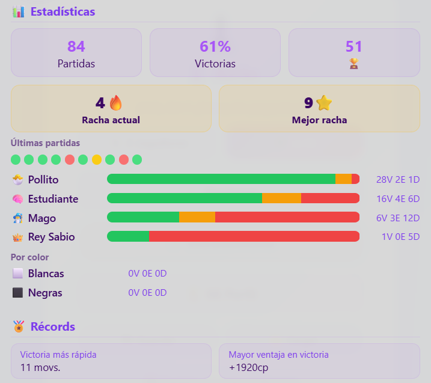
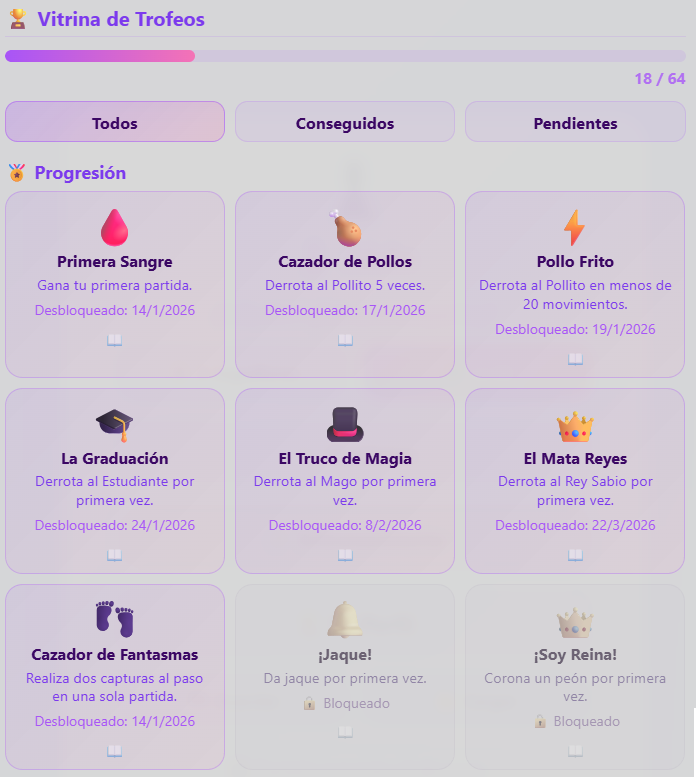
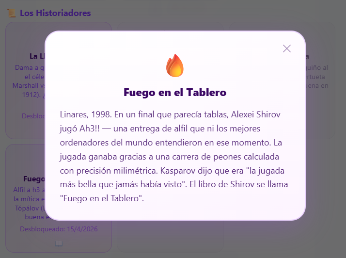

# ♟️ Airin Chess

> Un juego de ajedrez completo en un solo archivo HTML, construido para niños que aprenden a jugar.  
> Sin instalación. Sin internet. Sin cuentas. Abre el archivo `.html` en cualquier navegador.

[English README](README.md)

---

## Por qué existe este proyecto

Lo construí para mi hija de 9 años.

Quería aprender ajedrez, pero todas las aplicaciones que encontraba eran o demasiado difíciles (perdía constantemente y se rendía), demasiado simples (parecían un juguete), o estaban llenas de anuncios y distracciones. Quería algo que le enseñara el juego real — reglas FIDE, tácticas reales — pero que también le tendiera la mano cuando cometiera un error, le explicara *por qué* una jugada era mala y la celebrara cuando hiciera algo brillante.

El resultado es un juego que pone la pedagogía primero. El Profesor es más importante que la IA. Perder elegantemente ante una niña de 9 años es una característica del diseño, no un defecto.

---

## Objetivos y no-objetivos

### Objetivos

- **Enseñar, no derrotar.** El trabajo principal es explicar el juego, prevenir la frustración y construir el reconocimiento de patrones. El adversario IA es secundario.
- **Cero fricción.** Sin instalación, sin cuenta, sin internet tras la primera descarga. Funciona en un portátil de diez años igual que en un teléfono moderno.
- **Ajedrez real, no una versión simplificada.** Reglas FIDE completas: al paso, enroque, triple repetición, regla de los 50 movimientos, todo.
- **Indulgente abajo, desafiante arriba.** Fácil y Medio existen para que los principiantes sepan lo que es ganar. Difícil y Rey Sabio existen para cuando estén listos.
- **Maestría monolítica.** Todo — motor, entrenador, libro de aperturas, librería de entrenamiento, animaciones, sonidos — vive en un único archivo `.html` de ~860 KB. Cero dependencias.

### No-objetivos

- **Derrotar a jugadores titulados.** Esto no es Stockfish. El motor alcanza **~1652 ELO** en el nivel Mago y **~1830 ELO** en el nivel Rey Sabio (validado: torneos de 40 partidas vs UCI_Elo 1750, v2.23.0). La cifra exacta depende del hardware — ver nota de calibración más adelante.
- **Multijugador en línea.** Solo juego local.
- **Herramientas avanzadas de preparación.** El libro de aperturas está curado para enseñar, no para preparación profesional.
- **Rendimiento de referencia.** Un JavaScript limpio y legible tiene prioridad, aunque la v2.1.0 introdujo correcciones críticas en cuellos de botella de bajo nivel.

---

## Cómo jugar

**Localmente**

1. **Descarga** el archivo `.html`.
2. **Haz doble clic** sobre él. Se abre en cualquier navegador moderno (Chrome, Firefox, Safari, Edge).
3. **Elige** *vs IA* o *2 Jugadores* desde el menú principal.
4. **Haz clic en una pieza** para seleccionarla. Las casillas legales aparecen como puntos.
5. **Haz clic en un destino** para mover.

**En línea**

1. **Ve a** el sitio de GitHub Pages: [https://vafran.github.io/](https://vafran.github.io/)  
2. **Juega directamente** en el navegador. No se necesita descargar nada.

---

## Niveles de dificultad


| Nivel | ELO est. | Prof. | Tope de tiempo | Error | Libro |
|---|---|---|---|---|---|
| 🐣 Fácil | ~630 | 2 | 0,5s | 40% | ❌ |
| 📚 Medio | ~1010 | 5 | 5s | 15% | primeros 2 mov. |
| 🔥 Mago | ~1652 (validado) | hasta 30 | 15s | 0% | ✅ completo |
| 👑 Rey Sabio | ~1830 (validado) | hasta 30 | 30s | 0% | ✅ completo |

> **Hardware de calibración ELO:** CoolPC Black VIII — AMD Ryzen 7 3700X @ 4.4 GHz, 16 GB DDR4 3200 MHz (~95k NPS en condiciones de torneo).
>
> ⚠️ **Nota sobre el hardware:** Airin es un motor JavaScript puro que se ejecuta en el navegador. Su fuerza escala directamente con la velocidad de la CPU del dispositivo — el presupuesto de tiempo (15s / 30s) es fijo, pero la profundidad de búsqueda alcanzada dentro de ese presupuesto no lo es. En un PC de juego de gama media puedes esperar los valores ELO validados anteriores. En un portátil típico, aproximadamente 50–100 ELO menos; en un teléfono o tableta, 150–250 ELO menos. Fácil y Medio son en la práctica independientes del hardware — sus límites de profundidad (2 y 4) siempre se alcanzan mucho antes de agotar el tiempo en cualquier dispositivo moderno. El Mago y el Rey Sabio buscan tan profundo como el tiempo lo permite, por lo que su fuerza escala con el hardware del usuario.

---

## El Profesor

El corazón del juego. Tutor de ajedrez interactivo, contextual y bilingüe en todo momento.

### 🔍 Análisis
Evalúa control del centro, amenazas de rayos X, seguridad de piezas, seguridad del rey, balance material, fase de la partida y estado de la teoría de apertura.


### 🎯 ¿Qué hago?
Sugerencias de jugadas respaldadas por el motor, con indicadores de riesgo, explicaciones estratégicas, cabeceras de teoría de apertura y clic para resaltar en el tablero. **Ley de Kasparov:** cuando existe jaque mate, se muestra solo. **Ley del Comercio Justo:** las capturas de igual valor nunca activan avisos de pieza colgada.


### 💡 ¿Fue buena?
Veredicto post-jugada (Excelente / Buena / Aceptable / Inexactitud / Error) con flecha de refutación para los errores.


### 🦅 Ojo Halcón
Escáner visual de amenazas. Flechas rojas = tus piezas en peligro. Flechas verdes = capturas gratuitas disponibles.


### 🎓 Modo Entrenamiento
Sentido Araña (piezas atacadas brillan), casillas de destino con código de colores, prevención de colgadas con confirmación. Se desactiva automáticamente en el nivel Rey Sabio.


---

## Perfil de Jugador y Vitrina de Trofeos

Airin te recuerda. Cada partida que juegas queda registrada, y tu progreso se recompensa.

### 📊 Tu Perfil

Al abrir Airin por primera vez te pedirá tu nombre. A partir de ahí registra tu historial completo.

- **Estadísticas de por vida** — partidas totales, victorias, tablas, derrotas, deshacer usados, pistas pedidas
- **Estadísticas por color** — registro de victorias, tablas y derrotas por separado para las partidas con blancas y con negras
- **Salón de los Récords** — victoria más rápida (menos jugadas) y mayor ventaja de evaluación conseguida
- **Barras W/D/L por bot** — registro desglosado por nivel de dificultad con colores
- **Nombre editable** — pulsa sobre tu nombre en el perfil para cambiarlo en cualquier momento




### 🏆 La Vitrina de Trofeos — 64 Trofeos · 8 Medallas · 1 Leyenda

La Vitrina de Trofeos está construida sobre el propio tablero: **64 trofeos** (uno por cada casilla) en **8 categorías** (una por cada fila).

**🏅 Progresión (12)** — derrota cada nivel de dificultad, realiza tu primera captura al paso, da tu primer jaque, enroca por primera vez y más hitos del camino.

**🧠 Técnica (10)** — gana tras una remontada, enroca sin mover el rey, da jaque mate con el Rey activo en la 6ª fila, sube la Escalera Sin-Deshacer del Fácil al Rey Sabio.

**⚡ Implacable (9)** — para los que llevan los límites y no se rinden. Gana en 15 jugadas, derrota al Mago sin pistas, fuerza tablas contra el Mago, construye una racha de 3 victorias, gana 50 partidas con cada color, juega en 5 días distintos.

**📚 Aprendizaje (5)** — usa al Profesor 10 veces, explora 5 aperturas con nombre, completa 3 aperturas + 4 mate-1 + 6 mate-2 + 8 mate-3 + 10 mate-4 en la Librería de Entrenamiento (*FEN Master* 🧘), o usa el botón *¿Fue buena?* 5 veces para ganar el título de **El Analista**.

**⚔️ Táctica (9)** — patrones clásicos: torre en la 7ª fila, dobles torres, batería, horquilla de peón, jaque a la descubierta, tormenta de capturas y más.

**🥊 Dos Jugadores (7)** — 7 trofeos exclusivos del modo local 2 jugadores.

**📜 Los Historiadores (4)** — recrea sacrificios legendarios de la historia del ajedrez en tiempo real.

**🥚 Huevos de Pascua (9)** — nueve trofeos secretos. Nombres ocultos hasta desbloquearlos. Ya los descubrirás.

#### 8 Medallas de Categoría

Completa **todos los trofeos** de una categoría para ganar su medalla — una por fila del tablero. Las medallas aparecen como un estante en tu perfil por encima de la cuadrícula de trofeos. Toca cualquier medalla para ver su descripción y cuántos trofeos te faltan.



### 🏛️ Los Historiadores

Cuatro momentos históricos están escondidos en el juego. Cada uno requiere un sacrificio específico en condiciones de material concretas:

| Trofeo | Partida | Momento |
|--------|---------|---------|
| 🌧️ La Lluvia de Oro | Marshall vs Levitsky, 1912 | Dama a g3, atacada, mediojuego rico |
| 💥 El Cañonazo | Vladimirov vs Epishin, 1987 | Alfil a h6, atacado, mediojuego |
| 🚂 La Locomotora | Sanz vs Ortueta, 1933 | Torre a b2, atacada, final |
| 🔥 Fuego en el Tablero | Shirov vs Topalov, 1998 | Alfil a h3, atacado, final profundo |

Desbloquea los cuatro para ganar la medalla **El Gran Historiador** 📜.

La pestaña **Leyendas** de la Librería de Entrenamiento te permite cargar las posiciones exactas de estas partidas para estudiarlas y practicar los sacrificios.



### 🎉 Celebraciones en Tiempo Real

Cuando desbloqueas un trofeo durante una partida, aparece inmediatamente una notificación emergente — no hace falta revisar la vitrina. El juego reconoce el momento en el acto.


### 💾 Guardar y Cargar

Tu perfil vive en el navegador. Para llevarlo a otro dispositivo:

- **Exportar** — descarga `airin_save.json` en tu dispositivo
- **Importar** — sube un archivo exportado anteriormente para restaurar tu perfil en cualquier dispositivo


---

## El Comentarista

Narra cada movimiento en tiempo real. Reconoce nombres de aperturas, formación del Mate del Pastor, Regalo Griego, incursiones de caballo, motivos históricos y cambios importantes de material.

Tres estilos, con etiquetas ahora visibles bajo el deslizador:
- **🧐 Serio** — técnico y preciso
- **⚖️ Mixto** — equilibrado (por defecto)
- **🎉 Divertido** — humorístico y dramático


---

## Librería de Entrenamiento

| Pestaña | Posiciones | Contenido |
|---|---|---|
| Aperturas | 4 | Trampas guiadas: Mate del Pastor, Mate de Légal, Mate del Loco, Gambito Ponziani |
| Mate en 1 | 6 | Mates en 1 verificados |
| Mate en 2 | 12 | Mates en 2 verificados — 3 semijugadas |
| Mate en 3 | 16 | Mates en 3 verificados — 5 semijugadas |
| Mate en 4 | 22 | Mates en 4 históricos verificados — 7 semijugadas |
| Leyendas | 4 | Las 4 posiciones históricas (Marshall, Vladimirov, Sanz-Ortueta, Shirov-Topalov) |


---

## Reglas FIDE

| Regla | Estado |
|---|---|
| Generación de jugadas legales — todas las piezas | ✅ |
| Jaque, jaque mate, ahogado | ✅ |
| Captura al paso | ✅ |
| Enroque — ambos lados, derechos, bloqueado en jaque | ✅ |
| Coronación — auto-dama o elección del jugador | ✅ |
| Material insuficiente (KK, KBK, KNK, KBKB mismo color) | ✅ |
| Triple repetición con modal de reclamación | ✅ |
| Regla de los 50 movimientos | ✅ |
| Deshacer restaura el estado completo | ✅ |

---

## Opciones

| Opción | Valores |
|---|---|
| Idioma | 🇪🇸 Español / 🇬🇧 English (autodetectado en el primer acceso) |
| Tema visual | 🪄 Magia · 🌲 Bosque · 🌊 Océano · 🏛️ Clásico · ⚽ Fútbol |
| Estilo del comentarista | Serio · Mixto · Divertido |
| Sonido | Activado / Desactivado |
| Tema de sonido | 🎵 Clásico (golpe de madera) · 🕹️ Retro (pitidos) · 🎶 Suave (tonos) |
| Modo Entrenamiento | Activado / Desactivado |


## Problemas conocidos

| # | Gravedad | Descripción | Fix previsto |
|---|---|---|---|
| 1 | Baja | **Ahogado en posiciones ganadas (solo Rey Sabio)** — En finales simplificados muy poco frecuentes (dama + peones vs rey solo), el motor puede hacer un movimiento que ahogue al rey rival en lugar de darle jaque mate, convirtiendo una victoria en tablas. Causa: la búsqueda de quietud evalúa la posición final con `evaluate()` sin comprobar si el rival tiene jugadas legales. Ocurre aproximadamente 1 de cada 50 finales ganados con rey enemigo solo. | v2.14.0 — fix en la quiescence search |

---

## Lo nuevo en v2.25.1 — *Expansión de Puzzles y Herramientas FEN*

### ♟ Exportar FEN
* **Botón Copiar FEN** añadido junto al botón de copiar PGN en la barra del historial. Copia el FEN completo de la posición actual al portapapeles — útil para compartir posiciones, analizarlas en herramientas externas o importarlas en la Librería de Entrenamiento de Airin.

### 🎓 Librería de Entrenamiento — 64 Puzzles
* 17 nuevos puzzles añadidos (2 mate en 2, 3 mate en 3, 12 mate en 4) — total: **64 posiciones**.
* Distribución: 6 / 12 / 16 / 22 / 4 aperturas / 4 leyendas — más puzzles en las categorías más difíciles.
* Requisitos del trofeo FEN Master actualizados: **3 aperturas, 4 mate en 1, 6 mate en 2, 8 mate en 3, 10 mate en 4**.

### 🏫 Correcciones del Profesor
* Filtro anti-error desactivado al analizar puzzles de mate — los movimientos sacrificiales (Cf6+, Ah6, etc.) ya no son bloqueados.
* Detección correcta de mates por subpromoción (`cxb8=C#`) en el escáner de mate en 1.

---

## Lo nuevo en v2.25.0 — *Renovación de la Librería de Entrenamiento*

### 🎓 Nueva estructura de la Librería de Entrenamiento
* Las pestañas de **Táctica** y **Finales** han sido reemplazadas por **Mate en 1 / 2 / 3 / 4**. Todas las posiciones son puzzles verificados de Lichess.
* **Aperturas con guión** — el Mate del Pastor, el Mate del Loco y el Gambito Ponziani ahora se juegan paso a paso: el motor reproduce automáticamente los movimientos de error del rival para que el jugador viva la trampa completa.
* **Sistema de pistas** — los puzzles muestran un banner 🎓 en el panel del Profesor en lugar de un análisis genérico del motor.
* **Desafío aleatorio** ahora saca posiciones de la librería verificada completa (64 posiciones) — las posiciones no verificadas anteriores quedan retiradas.

### 🧘 Trofeo: FEN Master
* Se desbloquea completando **3 aperturas, 4 mate en 1, 6 mate en 2, 8 mate en 3 y 10 mate en 4** en la Librería de Entrenamiento.
* Los trofeos retirados se eliminan al cargar el perfil — las partidas guardadas existentes se limpian automáticamente.

### 🔊 Temas de Sonido
Tres temas de sonido sintetizados, seleccionables en Opciones (menú principal y durante la partida):
* **Clásico** — golpe de madera: ráfaga de ruido filtrado + cuerpo senoidal, que imita una pieza real sobre un tablero de madera. Al enrocar se escuchan dos golpes rápidos.
* **Retro** — pitidos de onda cuadrada.
* **Suave** — tonos senoidales.

### 🏛️ Leyendas — Rendiciones Históricas
Tras encontrar el sacrificio clave en cualquier puzzle de Leyendas, aparece un **modal de rendición** con el contexto histórico — la línea forzada, variantes clave y citas de época. Al pulsar **Seguir jugando** la IA continúa con los movimientos guionizados en el tablero.

*(Para el conjunto completo de funciones de El Estadístico en v2.24.0, consulta el Historial de versiones).*

---


## Historial completo de versiones

Consulta [docs/CHANGELOG_es.md](docs/CHANGELOG_es.md) para el historial completo de versiones.

## Arquitectura interna

### Diseño monolítico

~860 KB. Un único archivo `.html`. Sin dependencias externas, sin llamadas a CDN, sin cookies, sin peticiones de red tras la carga.

### Motor de búsqueda

Web Worker + motor de respaldo en el hilo principal. Pila alpha-beta: Profundización Iterativa, PVS, NMP (R adaptativo), LMR (fórmula logarítmica), Poda de Futilidad (profundidad ≤ 2, márgenes 175/350 cp), Ventanas de Aspiración (±75 cp), Búsqueda de Quietud (máx. 5 sin jaque / 8 en jaque, poda SEE, poda delta), Extensiones de Jaque, Extensiones de Peón Avanzado.

Tabla de transposición de 1 048 576 entradas (20 MB, `Int32Array`) con hashing Zobrist y preferencia por profundidad. Las entradas EXACT nunca se sobreescriben por entradas UPPER/LOWER. Cada entrada guarda la mejor jugada. Tablero en `Int8Array(64)` plano — 45–80k NPS en hardware típico.

Ordenación de jugadas: jugada TT (prioridad 1.000.000) → capturas MVV-LVA → coronaciones → jugadas asesinas → contramovimiento → heurística de historial → tropismo al rey. Las jugadas raíz se preordenan con MVV-LVA antes de la primera iteración.

### Evaluación

Tablas PST duales estilo PeSTO (`PST_MG` / `PST_EG`) con interpolación tapered entera (`(mgVal × ph + egVal × (24-ph)) / 24 | 0`). Estructura de peones: doblados −15, aislados −40, pasados escalados por fase + Regla del Cuadrado. Pareja de alfiles (+40). Escudo/Tormenta del rey (mediojuego). Actividad de torres (columna abierta +40, séptima fila +35, torres conectadas +15). Seguridad dinámica del rey. Detección de caballo-outpost. Penalización de mal alfil.

Valores de piezas: C=325, A=335, T=500, D=900. Interpolación tapered mediojuego/final.

### Libro de aperturas

~826 entradas en ~100 posiciones, con pesos teóricos en Difícil/Rey Sabio, aleatorio uniforme en Medio (2 movimientos), desactivado en Fácil.

### Audio

Todos los sonidos sintetizados en tiempo de ejecución con la Web Audio API. Sin archivos de audio empaquetados. Tres temas seleccionables: Clásico (ruido filtrado + senoidal), Retro (onda cuadrada) y Suave (senoidal).

---

## Soporte móvil

Viewport bloqueado · `touch-action: manipulation` · tablero `min(96vw, 520px)` · pantalla completa webkit · fallback del Worker.  
Probado en Chrome para Android, Safari para iOS, Firefox para Android.

---

## Compatibilidad

Requiere ES2017+. Probado en Chrome 90+, Firefox 88+, Safari 14+.

---

## Historial de versiones

[ChangeLog](docs/CHANGELOG_es.md)

---
<a name="colaboracion"></a>
## Ejemplos de colaboración con la IA

[Colaboración IA](docs/AI_COLLABORATION_es.md)

## Cómo contribuir

Airin es un único archivo `.html` sin paso de compilación, sin bundler y sin gestor de paquetes. Se abre en cualquier navegador y funciona directamente — lo que significa que muchas contribuciones se pueden probar en minutos.

### Contribuciones sencillas — sin torneo necesario

| Área | Qué hacer |
|---|---|
| Bugs | Abre un Issue con pasos para reproducir + captura de pantalla |
| Frases del comentarista | Añade entradas al objeto `I18N` en los bloques `es:` y `en:` |
| Libro de aperturas | Añade líneas a `OPENING_BOOK` (SAN separado por comas → `[{m, w}]`). Solo jugadas teóricas inequívocas — una jugada errónea del libro se ejecuta en todas las partidas |
| Posiciones de entrenamiento | Añade FENs a la Biblioteca de Entrenamiento con tema y descripción |
| UI / CSS | Edita estilos en línea o variables CSS; prueba abriendo el archivo directamente |

### Cambios al motor — torneo requerido

El motor de búsqueda es un alfa-beta de ~1.200 líneas dentro de un Web Worker. Cualquier cambio en la evaluación, los parámetros de búsqueda o el orden de jugadas requiere validación por torneo antes de poder fusionarse:

- **Validación de desarrollo (cada parche):** torneo de 20 partidas (~4 horas a 15s/jugada, ~7–8 horas a 30s/jugada)
- **Aprobación para release (fusión a main):** torneo de 40 partidas con UCI_Elo (~7,5 horas a 15s/jugada, ~14–16 horas a 30s/jugada)

```bash
cd stockfish_tests
# Desarrollo — valida cada parche (~4h a 15s)
node arena_tournament.js --batch --sf-mode uci_elo --sf-value 1750 --games 20
# Release — requerido antes de abrir un PR a main (~7,5h a 15s)
node arena_tournament.js --batch --sf-mode uci_elo --sf-value 1750 --games 40
```

Requiere Node.js, Puppeteer y `stockfish.exe` en la raíz del proyecto.

**La regla:** un cambio por PR. Nunca combines dos cambios al motor — si el ELO cae, no podrás aislar la causa. Ejecuta los torneos en un PC de escritorio (los portátiles sufren throttling térmico y producen estimaciones de ELO poco fiables). Incluye el JSON del torneo en la descripción del PR.

### Notas de arquitectura

- El juego completo vive en `mChess.html` (~860 KB, ~16.500 líneas). No hay otros archivos fuente.
- **Dos motores:** el Web Worker (juega todas las partidas reales) y el motor del hilo principal (solo para el Entrenador/análisis, nunca juega). Los cambios en uno no afectan al otro.
- **El código del Worker** es un string JS dentro de `createEngineWorker()` — edítalo como JS normal; el navegador lo vuelve a analizar en cada carga.
- **Bump de versión obligatorio** en cada cambio al motor — 4 lugares en el HTML: comentario `<!--`, `<title>`, texto del botón y `console.log`.
- **Pruebas:** abre el archivo via `file:///` directamente. No se necesita servidor.


---

## Pruebas con Stockfish (Entrenamiento del Motor)

Las heurísticas y pesos posicionales del motor han sido **entrenados y ajustados jugando torneos automatizados contra Stockfish**. Esta carpeta agrupa las utilidades para ejecutar partidas automáticas entre `mChess.html` y Stockfish, recoger resultados y generar análisis rápidos.

- Ubicación: [stockfish_tests](stockfish_tests)
- Comandos rápidos (desde la raíz del proyecto):

```bash
# Ejecutar un torneo de 20 partidas en modo batch (sin interrupciones, guarda JSON automáticamente)
node stockfish_tests/arena_tournament.js --batch --depth 7 --games 20

# Inspeccionar resultados
node stockfish_tests/analyze_results.js
```

Notas:
- `arena_tournament.js` abre `../mChess.html` (carpeta padre) y por defecto espera `stockfish.exe` en la raíz. Puede usarse la variable de entorno `STOCKFISH_PATH` para especificar otro ejecutable.
- Los resultados y sugerencias se guardan en `stockfish_tests`.

## Licencia

Apache License 2.0  
Copyright 2026 Aaron Vazquez Fraga

---

## Cómo se construyó

Airin Chess fue diseñado y dirigido por Aaron Vazquez Fraga. El código fue escrito casi en su totalidad por asistentes de inteligencia artificial.

La mayor parte de la implementación — arquitectura del motor, técnicas de búsqueda, el sistema del Profesor, el libro de aperturas, la librería de entrenamiento y la mayoría de las correcciones de bugs — fue escrita por **Claude Sonnet** (Anthropic). **Gemini Pro** (Google) contribuyó a decisiones estructurales tempranas y enfoques alternativos. **ChatGPT** (OpenAI) ayudó con problemas concretos en las fases iniciales del desarrollo.

Las ideas, la pedagogía, las decisiones de producto, las más de 1000 partidas de prueba y la dirección de cada iteración vinieron de una persona que quería una forma mejor de enseñar ajedrez a su hija. El código vino de los modelos.

Este es un registro honesto de cómo se construyó el proyecto. Es también, quizás, un documento de cómo se ve la colaboración entre humanos e IA cuando funciona bien.

---

*Airin Chess v2.25.0 — Un juego de ajedrez hecho para una niña de 9 años, que accidentalmente se convirtió en un motor serio.* *~1,08 MB. Sin dependencias. Abre el archivo y juega.*
